* Table of Contents
{:toc}

--------------------------------------------------------------------------------------------------------------------

## **Setting up, getting started**

Refer to the guide [_Setting up and getting started_](SettingUp.md).

--------------------------------------------------------------------------------------------------------------------

## **Introduction**

### **Purpose**
This document describes the architecture and system design of the Teletubbies desktop application
for Telemarketers and Telemarketer Supervisors.

### **Scope**
The document aims to comprehensively cover the software architecture and software design decisions for
the implementation of Teletubbies. It is intended to serve as a guide for the developers, the designers, and the testers
for the application.

The definitions for the emboldened terms can be found in the [_Glossary_](#glossary) Section.

### **Design Goals**
The developers work closely with telemarketers and telemarketer supervisors to better understand their needs, so that
the requirements of the product can be as clear-cut as possible.

#### _User-Centricity_
Teletubbies can be used by both telemarketers and supervisors, and chooses the appropriate features according to the
current user's **role**, so that the user can work effectively and efficiently to complete their tasks.

#### _Improved Workflow Efficiency_
Teletubbies is optimised for **Command-Line Interface** (CLI) usage, which streamlines workflow
within the application by centralising the entering of commands in a single text input window.

#### _Seamless Data Integration_
Teletubbies allows telemarketers, and their supervisors to share and merge data seamlessly. Synchronization of customer
data between telemarketers and their supervisors is often a necessary aspect of their job, and Teletubbies provides
avenues to make this process easy and hassle-free.

#### _Data Safety and Recoverability_
With many contacts stored in a contact list, it is vital that the user’s current progress is saved 
frequently to assist in data recovery in the event of unexpected system failure. Hence, the contact list is saved 
after each command issued by the user.

Additionally, in the event of human error, an undo command is available for users to revert to previous states
within the session itself.

#### _Scalability & Maintainability_
Within a team of developers, it is important that the developers reduce dependencies within the project to increase
testability and extensibility.

In addition, with requirements that constantly change, it is important to be able to easily modify features and
functionalities that have already been written without disturbing other related components. Therefore, the main 
components of the application such as the `Logic`, `UI`, `Model`, and `Storage` are separated into decoupled modules.

Along with the strict adherence to software design principles, such as **Single Responsibility** and
**Separation of Concerns**, the modularity of the software design allows future developers to add features to Teletubbies
without having to deal with tedious side effects.

### **Glossary**
**_Command-line Interface (CLI)_**: A user interface that allows users to interact with a system through text commands.

**_Graphical User Interface (GUI)_**: A user interface that allows users to interact with a system through graphical icons.

**_User stories_**: Simple descriptions of features told from the perspective of the user.

**_Completion Status_**: A contact can be marked as either “complete”, "ongoing" or “incomplete”, indicating if the contact has been contacted.

**_Role_**: Users are assigned either the role of telemarketer or supervisor.

**_Single Responsibility Principle_**:  A software engineering principle that states that every module, class or
function in a computer program should be responsible for and encapsulate only a single part of
the program’s functionality.

**_Separation of Concerns Principle_**: A software engineering principle that states that programs should be separated
into distinct sections which address concerns, or sets of information that affects the code of a computer program.

--------------------------------------------------------------------------------------------------------------------

## **Acknowledgements**

* [_SE-EDU Remark Command tutorial_](https://nus-cs2103-ay2122s1.github.io/tp/tutorials/AddRemark.html)

--------------------------------------------------------------------------------------------------------------------

## **System Overview**

<div markdown="span" class="alert alert-primary">

:bulb: **Tip:** The `.puml` files used to create diagrams in this document can be found in the [diagrams](https://github.com/se-edu/addressbook-level3/tree/master/docs/diagrams/) folder. Refer to the [_PlantUML Tutorial_ at se-edu/guides](https://se-education.org/guides/tutorials/plantUml.html) to learn how to create and edit diagrams.
</div>

### Architecture


The ***Architecture Diagram*** given above explains the high-level design of the App.

Given below is a quick overview of main components and how they interact with each other.

#### Main components of the architecture

`Main` has two classes called [`Main`](https://github.com/AY2122S1-CS2103T-W15-4/tp/blob/master/src/main/java/teletubbies/Main.java) and [`MainApp`](https://github.com/AY2122S1-CS2103T-W15-4/tp/blob/master/src/main/java/teletubbies/MainApp.java). The `Main` component,
* (At app launch) initializes the components in the correct sequence, and connects them up with each other.
* (At shut down) shuts down the components and invokes cleanup methods where necessary.

[**`Commons`**](#common-classes) represents a collection of classes used by multiple other components.

The rest of the App consists of four components.

* [**`UI`**](#ui-component): The UI of the App.
* [**`Logic`**](#logic-component): The command executor.
* [**`Model`**](#model-component): Holds the data of the App in memory.
* [**`Storage`**](#storage-component): Reads data from, and writes data to, the hard disk.

#### How the architecture components interact with each other

The Sequence Diagram below outlines how the components interact with each other, in a scenario where the user issues the command `delete -p 87654321`.

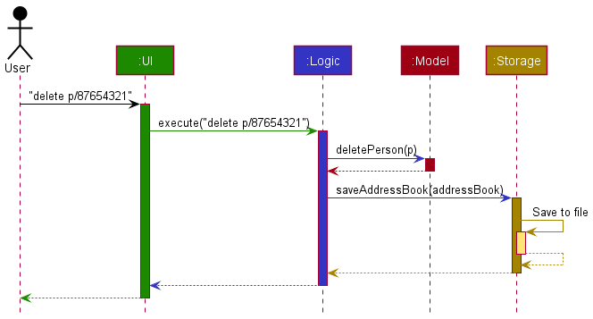

Each of the four main components (also shown in the diagram above),

* defines its *API* in an `interface` with the same name as the Component.
* implements its functionality using a concrete `{Component Name}Manager` class (which follows the corresponding API `interface` mentioned in the previous point.

For example, the `Logic` component defines its API in the `Logic.java` interface and implements its functionality using the `LogicManager.java` class which follows the `Logic` interface. Other components interact with a given component through its interface rather than the concrete class (reason: to prevent outside component's being coupled to the implementation of a component), as illustrated in the (partial) class diagram below.


The sections below give more details of each component.

### UI component

**API** : [`Ui.java`](https://github.com/AY2122S1-CS2103T-W15-4/tp/blob/master/src/main/java/teletubbies/ui/Ui.java)

Here's a (partial) class diagram of the `UI` component:


The UI consists of a `MainWindow` that is made up of parts such as `CommandBox`, `ResultDisplay`, `PersonListPanel`, `StatusBarFooter`, etc. All these parts, including the `MainWindow` itself, inherit from the abstract `UiPart` class which captures the commonalities between the classes that represent parts of the visible GUI.

The `UI` component uses the JavaFX UI framework. The layout of these UI parts are defined in matching `.fxml` files that are in the `src/main/resources/view` folder. For example, the layout of the [`MainWindow`](https://github.com/AY2122S1-CS2103T-W15-4/tp/blob/master/src/main/java/teletubbies/ui/MainWindow.java) is specified in [`MainWindow.fxml`](https://github.com/AY2122S1-CS2103T-W15-4/tp/blob/master/src/main/resources/view/MainWindow.fxml).

The `UI` component,

* executes user commands using the `Logic` component.
* listens for changes to `Model` data so that the UI can be updated with the modified data.
* keeps a reference to the `Logic` component, because the `UI` relies on the `Logic` to execute commands.
* depends on some classes in the `Model` component, as it displays each `Person` object residing in the `Model`.

### Logic component

**API** : [`Logic.java`](https://github.com/AY2122S1-CS2103T-W15-4/tp/blob/master/src/main/java/teletubbies/logic/Logic.java)

Here's a (partial) class diagram of the `Logic` component:

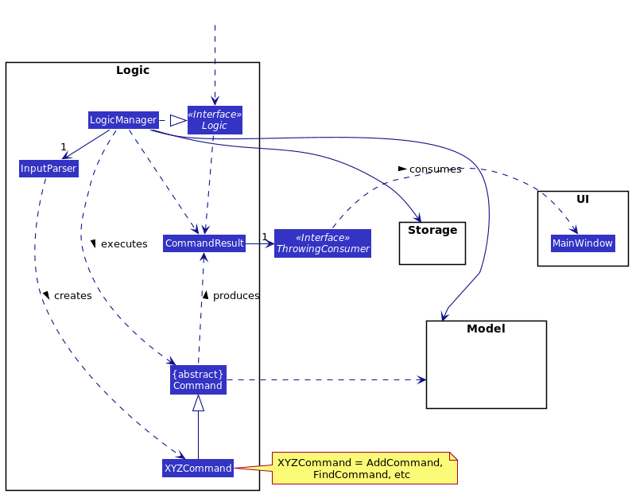

How the `Logic` component works:
1. When `Logic` is called upon to execute a command, it uses the `InputParser` class to parse the user command.
2. This results in a `Command` object which is executed by the `LogicManager`.
3. The command can communicate with the `Model` when it is executed (e.g. to add a person).
4. The result of the command execution is encapsulated as a `CommandResult` object which is returned from `Logic` back to the `UI`.
5. The `CommandResult` object also contains a `UiConsumer` object, which consumes `MainWindow` from `UI`, and encapsulates instructions for 
the Command's UI effects (e.g. opening help menu, opening file select window).


The Sequence Diagram below illustrates the interactions within the `Logic` component for the `execute("delete -i 1")` API call.


<div markdown="span" class="alert alert-info">:information_source: **Note:** The lifeline for `DeleteCommandParser` should end at the destroy marker (X) but due to a limitation of PlantUML, the lifeline reaches the end of diagram.
</div>

In the diagram above, the creation of the `UiConsumer` object is represented. Since DeleteCommand does not have a UI effect, the consumer simply does nothing. For more details on how a UI effect is 
executed, please see [Commands with UI effects](#commands-with-ui-effects). Subsequent sequence diagrams for commands with no UI effect might omit the `UiConsumer` portion of `Command Result`.

Here are the other classes in `Logic` (omitted from the class diagram above) that are used for parsing a user command:

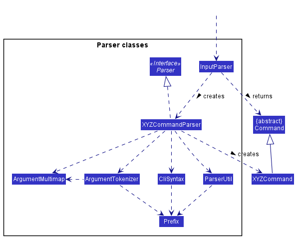

How the parsing works:
1. When called upon to parse a user command, the `InputParser` class creates an `XYZCommandParser`. Here, `XYZ` is a placeholder for the specific command name, e.g. `AddCommandParser`.
2. The newly created `XYZCommandParser` class utilizes the other classes shown above, such as `ParserUtil`, `CliSyntax`, etc. to parse the user command and create a `XYZCommand` object, e.g. `AddCommand`.
3. The `InputParser` will then return the newly created `XYZCommand` object as a `Command` object.

All `XYZCommandParser` classes like `AddCommandParser` and `DeleteCommandParser` inherit from the `Parser` interface so that they can be treated similarly where possible, such as during testing.
Similarly, all `XYZCommand` classes inherit from the `Command` class.

### Model component

**API** : [`Model.java`](https://github.com/AY2122S1-CS2103T-W15-4/tp/blob/master/src/main/java/teletubbies/model/Model.java)

Here's a (partial) class diagram of the `Model` component:


The `Model` component,

* stores the list of contacts and all previous lists (or address books) in`VersionedAddressBook`, which inherits from `AddressBook`.
* stores a history of all commands that were input by the user using `CommandInputHistory`.
* stores the currently 'selected' `Person` objects (e.g. results of a search query) as a separate _filtered_ list, exposed to outsiders as an unmodifiable `ObservableList<Person>`.
* stores a `UserPref` object that represents the user’s preferences.
* does not depend on any of the other three components (as the `Model` represents data entities of the domain, they should make sense on their own without depending on other components).


### Storage component

**API** : [`Storage.java`](https://github.com/AY2122S1-CS2103T-W15-4/tp/blob/master/src/main/java/teletubbies/storage/Storage.java)


The `Storage` component,
* can save both address book data and user preference data in json format, and read them back into corresponding objects.
* inherits from both `AddressBookStorage` and `UserPrefStorage`, which means it can be treated as either one (if only the functionality of only one is needed).
* depends on some classes in the `Model` component (because the `Storage` component's job is to save/retrieve objects that belong to the `Model`)

### Common classes

Classes used by multiple components are in the `teletubbies.commons` package.

--------------------------------------------------------------------------------------------------------------------

## **Implementation**

This section describes some noteworthy details on how certain features are implemented.

### Commands with UI effects

Commands that require a UI effect will need to set up the `UiConsumer` functional interface that allows the commands to access the functionality
of `MainWindow`. The following is an example of a constructor for `CommandResult` that includes this set-up:

```java
new CommandResult(MESSAGE, UiEffect.SHOW_HELP, new HelpUiConsumer());
```

The third argument of this method call (`new HelpUiConsumer()`), is a `UiConsumer` that uses the `handleHelp` method in `MainWindow`. More complicated effects
can be constructed with the exposed functions in `MainWindow` (See [Import, Merge and Export Feature](#import-merge-and-export-features)). The `UiConsumer` can be implemented 
either as a concrete class (like `HelpUiConsumer`) or as a lambda function.

If the `UiEffect` type (the second constructor argument) does not exist for a new command that you want to add, this corresponding `UiEffect`
type should be added into the `UiEffect` enum in `CommandResult`.

On the other hand, if a command has no special UI response, the `UiEffect` type should be `NONE`.

#### Implementation (`help` command)

This section describes the implementation of the `help` command. The implementation of other commands that make use of UI effects/responses (e.g. 
file choosers, pop-up windows) will be similar.

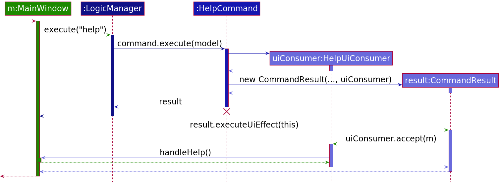

<div markdown="span" class="alert alert-info">:information_source: **Note:** The lifeline for `ImportCommand` should end at the destroy marker (X) but due to a limitation of PlantUML, the lifeline reaches the end of diagram.
</div>

**Step 1.** The user enters the `help` command in the command box. 

**Step 2.** A `CommandResult` object containing a `UiConsumer` is created and returned by the `HelpCommand`. The `UiConsumer` contains instructions for the UI effect of the help command.

**Step 3.** `MainWindow` calls `CommandResult#executeUiEffect` of the returned `CommandResult` object, which in turn call the `UiConsumer`. 

**Step 4.** The `UiConsumer` (which contains the implementation for the `help` command's) UI effect, calls `MainWindow#handleHelp` which invokes the help window pop-up.

#### Design Considerations

* **Alternative 1 (current implementation):** Use `UiConsumer` to encapsulate UI effects
    * Pros
      * Allows UI effects to be open for extension and closed for modification. Adding additional UI effects incur minimal cost.
      * UI effects can contain a combination of features exposed by `MainWindow` to create arbitrarily complex UI effects.
    * Cons
      * Creates significant coupling between `MainWindow` (UI) and `UiConsumer` (Logic).
      
* **Alternative 2 (previous implementation):** Use boolean flags in `CommandResult` to signify instructions for UiEffects
    * Pros
        * Ease of implementation
    * Cons
        * If a new UI effect needs to be allowed, both `MainWindow` and `CommandResult` will need to be modified with further boolean flags and checks for whether a UI effect has been enabled. This would be in violation of the open-closed principle, since this is not closed to modification.
        
### Import, Merge and Export Features

#### Implementation

The `import`, `merge` and `export` mechanisms are supported by all the main components, specifically in the following ways:

* The `Ui` component is accessed in `CommandResult` through the `UiConsumer`. This allows the user to interact with the JavaFX FileChooser to select files to be imported, merged or exported to.

* The execution of the `ImportCommand`, `MergeCommand` and `ExportCommand` is distinct from other commands executed by `Logic` because it is passed to the UI consumer in the `CommandResult` due to their reliance on the UI file chooser.

* For import, the `Model` component is accessed to set the new AddressBook of contacts. For merge, contacts are merged with the current AddressBook. On the other hand, export filters the AddressBook of the `Model` using the tags specified in the user command to retrieve contacts to be exported.

* Functions in `Storage` were used to write AddressBooks to JSON files as well as read and convert JSON files to AddressBook objects.

#### Import Implementation

The `ImportCommand` allows users to import contact files to the Teletubbies app. The following sequence diagram shows how the `import` operation works:

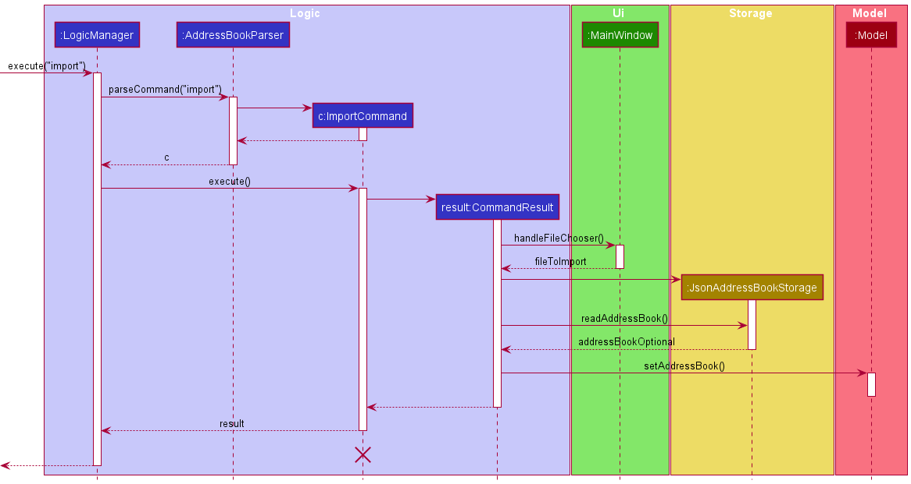

<div markdown="span" class="alert alert-info">:information_source: **Note:** The lifeline for `ImportCommand` should end at the destroy marker (X) but due to a limitation of PlantUML, the lifeline reaches the end of diagram.
</div>

* After an `ImportCommand` is created, it will be executed by the `LogicManager`. During the execution, a new `CommandResult` is returned with the `ImportUiConsumer`.
* `CommandResult#executeUiEffect` is called by the `MainWindow`. The `ImportUiConsumer` then calls `MainWindow#handleImport`, which opens the file chooser for the user to choose a file to import. 
* When the file is selected, the `ImportUiConsumer` converts the JSON file to an AddressBook and calls `Model#setAddressBook`. The updated contact list is then displayed in the GUI.

#### Merge Implementation

Merge functions in a similar way to import. However, instead of replacing the previous AddressBook, the incoming AddressBook is merged with it.

Teletubbies provides commands for users to modify contacts by editing their particulars or tagging them. Since a Person can be entirely changed, each Person is issued a Universally Unique Identifier (UUID) to facilitate the merging process.
* If there is a Person with a matching UUID in the AddressBook, the incoming Person would replace it. 
* Else, the Person is new and would be added to the AddressBook.

The following sequence diagram shows how the `merge` operation works:

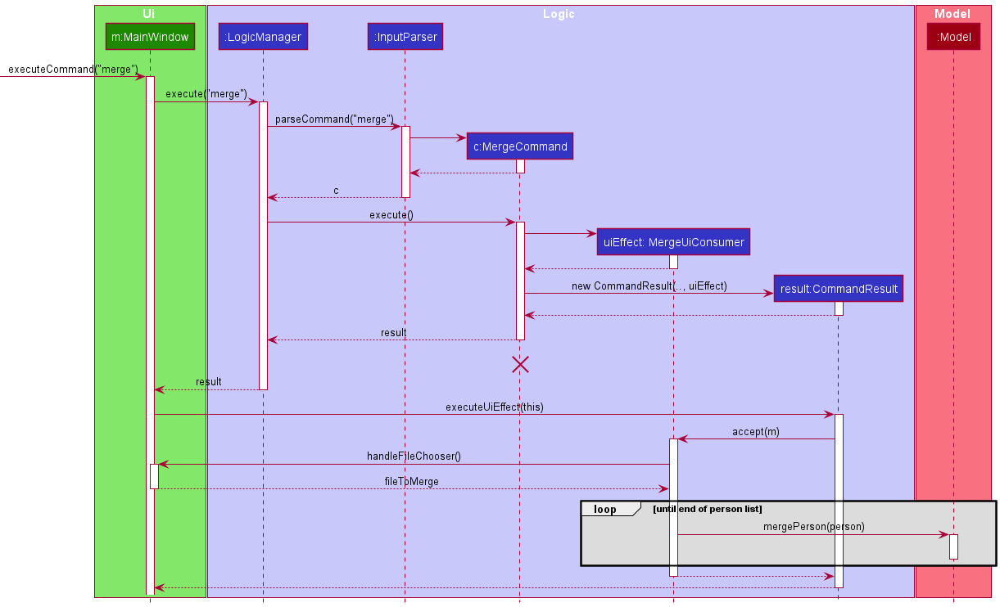

<div markdown="span" class="alert alert-info">:information_source: **Note:** The lifeline for `MergeCommand` should end at the destroy marker (X) but due to a limitation of PlantUML, the lifeline reaches the end of diagram.
</div>

#### Export Implementation

Export is distinct from other features as it comprises of 2 commands, as illustrated in this activity diagram:


As seen in the activity diagram above,
* The first command gives users a preview of the contacts to be exported
* Second command is carried out by the user to confirm and execute the export
* If the user types in another command instead of confirming the export, the pending export is cancelled and the new command is executed. 

The following sequence diagram shows how the `export` operation works:

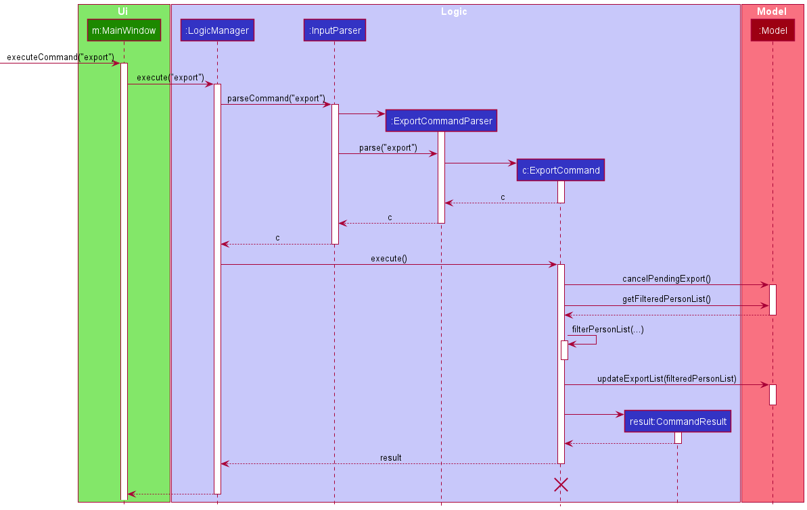

The first `export` command processes the AddressBook to filter contacts that contain the tags specified by the user. This is then stored in the `Model` until the export is confirmed and is displayed to the user too. 

The interaction between `ExportCommand` and `Model` is illustrated in the sequence diagram below:


The `ExportCommand` calls `Model#updateExportList`, invoking `ModelManager` to do the following:
* Set the boolean `isAwaitingExportConfirmation` to true to manage the subsequent confirmation command.
* Update the Model's `versionedAddressBook` with the `filteredPersonsList`. This displays the filtered contact list for users to view before confirming export.
* Create a copy of the filtered address book and compares it with the previous address book. If they are different, `ModelManager` calls `VersionedAddressBook#commitCurrentStateAndSave`, which commits and pushes the state on the `HistoryManager`. This enables `ModelManager` to revert to the original address book after the next command is executed. 

The following sequence diagram shows how the `ConfirmExport` operation works:

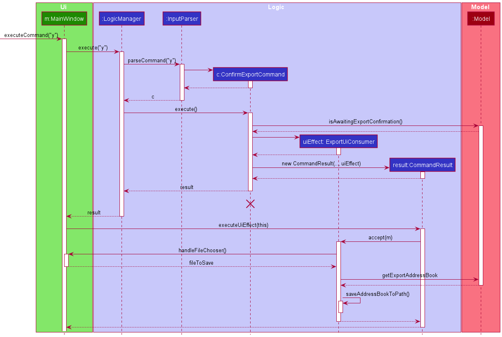

The execution of the `ConfirmExportCommmand` is similar to the `import` and `merge` commands in the use of `UiConsumer`. If `isAwaitingExportConfirmation` in the `Model` is true, the `ExportUiConsumer` retrieves the AddressBook to be exported from the `Model` as shown in the sequence diagram below:

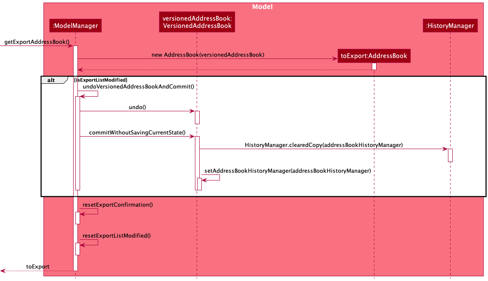

The `ExportUiConsumer` calls `Model#getExportAddressBook`, invoking `ModelManager` to do the following:
* Creates a copy of the AddressBook called `toExport` containing contacts to be exported. This is subsequently returned to the `ExportUiConsumer` to be converted and exported as a JSON file.
* If `isExportListModified` was set to true in the `ExportCommand`, 
    * `versionedAddressBook` is undone.
    * `VersionedAddressBook#commitWithoutSavingCurrentState()` is called, which clears the history after the `historyStack` pointer and resets the `HistoryManager` of the `versionedAddressBook`.
* Resets export related booleans in `ModelManager`.

During the execution of other Teletubbies commands, `Model#cancelPendingExport()` is called to undo the `VersionedAddresBook` if there is a pending export, before the actual execution of the command. The operation of `Model#cancelPendingExport()` is shown in the sequence diagram below:

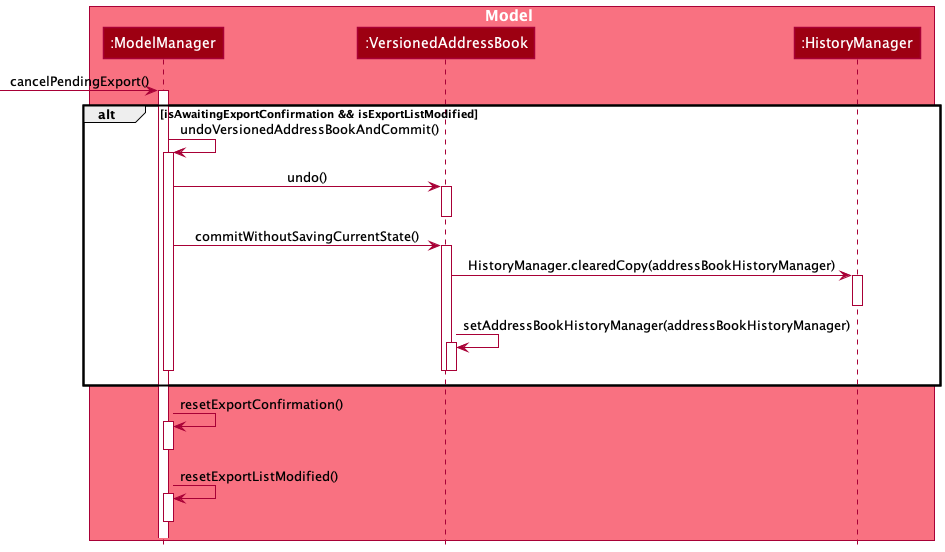

The `VersionedAdressBook` and `HistoryManager` are reset in the same way as `Model#getExportAddressBook`, which was elaborated above. 

#### Design Considerations

**Aspect: How to allow commands to specify UI effects**

* **Alternative 1 (current choice):** Import/Export/Merge command can be executed by CLI command or menu bar button.
    * Pros: Users are given the flexibility of choosing either method to enter the command according to their preference.
    * Cons: Contacts to be exported are unable to be filtered by tags in the menu bar button.

* **Alternative 2:** Import, export and merge are buttons in the menu bar only.
    * Pros: Similar to the layout of menu bars in Microsoft Office Applications, which might be familiar to users.
    * Cons: Target users can type fast and might prefer typing in commands. Contacts to be exported are unable to be filtered by tags.

### Profile Feature

#### Implementation

Setting the user's profile is facilitated through the `ProfileCommand` and the `ProfileCommandParser` class, which
parses the user's input to create a new `UserProfile` object to be set in the current `Model` component.

The following activity diagram summarizes what happens when a user executes a `profile` command:

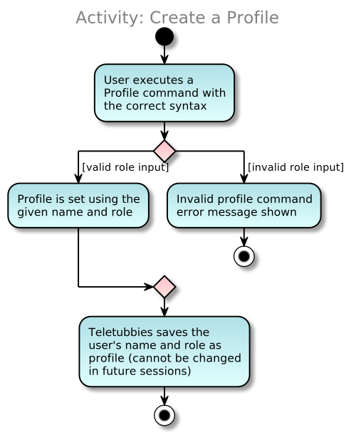

The following sequence diagram further illustrates how the `profile` command operation works:

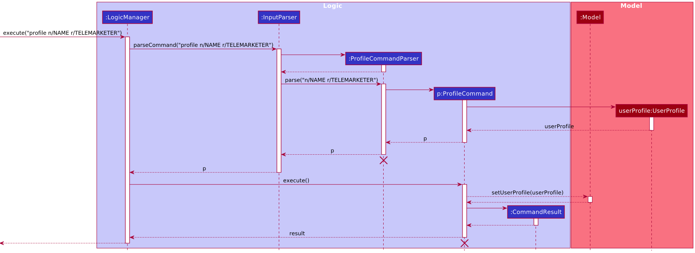

<div markdown="span" class="alert alert-info">:information_source: **Note:** The lifeline for `ProfileCommandParser` and `ProfileCommand` should end at the destroy marker (X) but due to a limitation of PlantUML, the lifeline reaches the end of diagram.
</div>

#### Design Considerations

**Aspect: Parameters of the `profile` command**

* **Alternative 1 (current choice):** Profile is set with both name and role as mandatory fields.
    * Pros: Ensures that both name and role are accounted for when changing the profile.
    * Cons: Both fields must be entered for the user to set the profile, which can be tedious if it has to be done multiple times.

* **Alternative 2:** Profile can be set with only the name, or both name and role.
    * Pros: Allows users to change their name alone without having to enter role as well.
    * Cons: The cost of implementation is not heavily outweighed by the explicit need for the feature, as there should be infrequent changes in the user's name.
    
**Aspect: Number of times the user's profile can be set**

* **Alternative 1 (current choice):** Profile can only be set once per user, excluding any undo.
    * Pros: Ensures that users are unable to switch between telemarketer and supervisor functionalities. In the case where
the user has misspelt their name, they can still use the undo command to revert back and re-enter the name for their profile.
    * Cons: The user is unable to set their profile again in the case where their name or role has changed.

* **Alternative 2:** No limits are placed on the number of times the user is able to set their profile.
    * Pros: Allows users to change their name or role as needed, hassle-free.
    * Cons: There is no explicit need for the feature, as there should be infrequent changes in the user's name and role.

### Profile feature - Reset profile

#### Implementation

As stated above, users are only able to set their profile **once** using the `profile` command. 
However, there may be times when there is a need for the users to change their name and/or role. In such circumstances,
it is possible for the users to reset their profile by manually deleting `preferences.json`.

The following activity diagram summarizes what happens when a user deletes `preferences.json`:

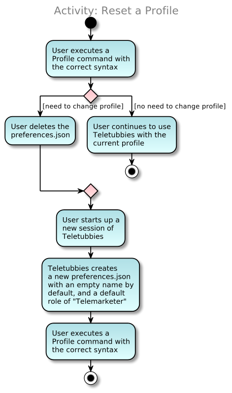

### Mark Contacts as Done Feature

#### Implementation

Marking contacts as done, or contacted, is assisted by `CompletionStatus`. It has a composition association with `Person`
and holds a boolean value indicating that the person has been contacted by the telemarketer.

The following sequence diagram shows how the `done` operation works:

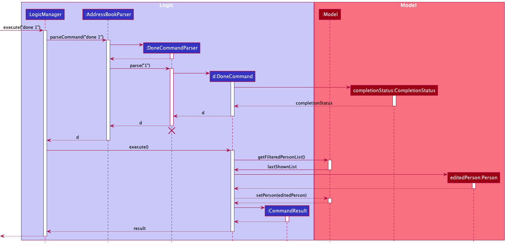

### Delete Contacts Feature

#### Implementation

Deletion of a contact is supported by the `DeleteCommand` and `DeleteCommandParser` classes. The `DeleteCommandParser`
parses the user's input and deletes the contact at the given index or with the given phone number.

The following sequence diagram shows how the `delete` operation works:

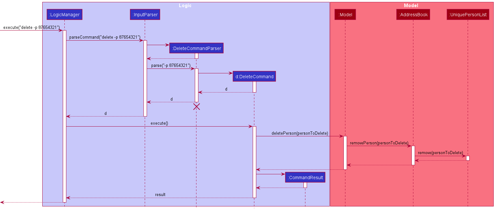

<div markdown="span" class="alert alert-info">:information_source: **Note:** The lifeline for `DeleteCommandParser` should end at the destroy marker (X) but due to a limitation of PlantUML, the lifeline reaches the end of diagram.
</div>

The following activity diagram summarizes what happens when a user executes a delete command:

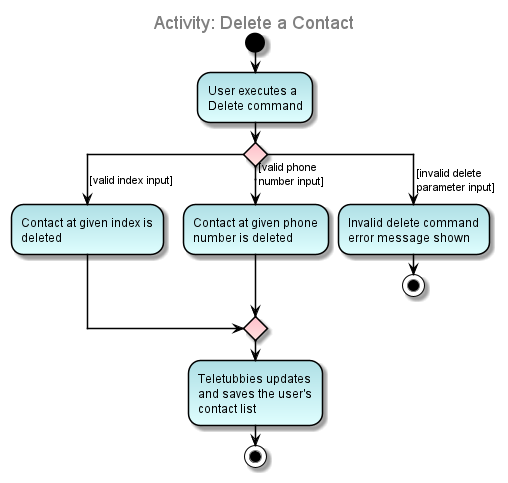

#### Design Considerations

**Aspect: Parameters of the `delete` command**

Since the telemarketer is responsible for talking to customers on the phone to sell products,
it will be useful for them to interact with their contact lists through the customer's phone number.

* **Alternative 1 (current choice):** Delete using either index or phone number.
    * Pros: Flexibility in method of deletion, as users can specify whether they would like to reference a contact by
      index or phone number by using the `-i` or `-p` prefixes.
    * Cons: Slightly more complicated for user to delete a contact, as a longer command has to be typed.

* **Alternative 2:** Delete via phone number only.
    * Pros: Implementation is more straightforward, as there is only one type of input to be expected.
    * Cons: Removes the convenience of deleting using a contact's index.

### Tag feature

The following section will describe the implementation of the tag feature. The implementation for remove tag feature is 
similar and hence won't be repeated in this section. 

The `TagCommand` allows users to tag contacts. A tag has a mandatory name and an optional value (both are case-sensitive).
It also requires a specification of indices of the contacts to tag. To allow batch tagging, this is done with a `Range`
(found in `commons/core/index`). A `Range` encapsulates a set of indices. The `TagCommandParser` supports ranges of the 
form `1,2,3` (Comma-separated) or `1-5` (Hyphen-separated). The parsing of range is handled by `ParserUtil#parseRange`.

The sequence diagram below represents the creation of a `TagCommand` object by the `TagCommandParser`. Details related to 
obtaining the tag's name, value and supervisor flag have been omitted from the diagram below.

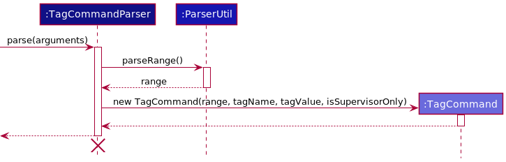

<div markdown="span" class="alert alert-info">:information_source: **Note:** The lifeline for `ProfileCommandParser` and `ProfileCommand` should end at the destroy marker (X) but due to a limitation of PlantUML, the lifeline reaches the end of diagram.
</div>

After the creation of the `TagCommand`, it will be executed by `LogicManager`. Below is the sequence diagram for the execution 
of the `TagCommand`.

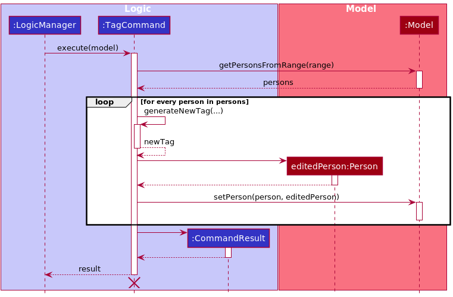

<div markdown="span" class="alert alert-info">:information_source: **Note:** The lifeline for `ProfileCommandParser` and `ProfileCommand` should end at the destroy marker (X) but due to a limitation of PlantUML, the lifeline reaches the end of diagram.
</div>

**Step 1.** `LogicManager` executes the `TagCommand`.

**Step 2.** `TagCommand` obtains the list of `Person`s corresponding to its range.

**Step 3.** For each person in the obtained person list a new tag is generated by generateNewTag() and added to the person's list of tags (or used to replace the existing 
tag if the person already has the tag). The new set of tags is used to instantiate the `editedPerson`. Details of adding the tag to the `editedPerson` has been 
omitted for brevity.

**Step 4.** The updated `editedPerson` is used to replace the original `person` with `setPerson`.

#### Design Considerations

Tags are used extensively in Teletubbies with a variety of purposes. Tags in Teletubbies are much more versatile than their
implementation in AB-3. Tags now have both names and values, and can also be set to be only editable by supervisors. This
allows for supervisors to create assignee tags for example, with name 'assignee' and value as the name of the assignee. 
The tag can also be set to be modifiable only by supervisors, so that employees won't be able to tamper with the manpower 
assignment. 

The completion status of a contact is also internally represented as a tag, with name 'CompletionStatus' and value
either 'INCOMPLETE', 'ONGOING' or 'COMPLETE'. Since the `filter` and `export` commands make use of tags, this allows users to filter and
export contacts by 'CompletionStatus', since CompletionStatus is also a tag after all. Supervisors can also export contacts corresponding
to a particular assignee for contact dissemination, which is a critical feature for supervisors.

**Aspect: How general (in terms of functionality) should tags be?**

* **Alternative 1 (current choice):** Users are free to set tag name, value and accessibility
    * Pros: 
      * Users have more configurability options for tags, which opens up use-cases and ultimately makes tags more useful.
      * Implementation for `filter` and `export` is simplified since only tags will be used to specify contacts for these commands.
    * Cons: 
      * Commands pertaining to adding and removing tags now get more complex and risk being counter-intuitive since there are more configuration options. 

* **Alternative 2:** Tags only have a name attribute.
    * Pros: 
      * Ease of implementation (virtually identical to AB-3).
      * Lesser configurability of tags and hence simpler and easier to use tag commands.
    * Cons: 
      * Separate functionality will need to be created for assignee and completion status, which will function very similarly to tags, but are not tags.
      * `filter` and `export` commands will potentially be a lot more complex, since users can export by tags, completion status or assignee, and they can't be handled similarly.


### Filter feature

The following section will describe the implementation of the filter feature. The use of a `Predicate<Person>` here to 
filter the person list is similar to the implementation of the find feature. 

The sequence diagram below represents the creation of a `FilterCommand` object by the `FilterCommandParser`.

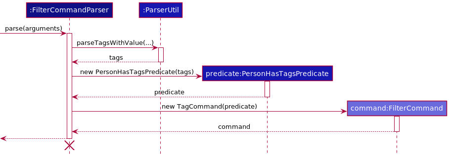

<div markdown="span" class="alert alert-info">:information_source: **Note:** The lifeline for `ProfileCommandParser` and `ProfileCommand` should end at the destroy marker (X) but due to a limitation of PlantUML, the lifeline reaches the end of diagram.
</div>

`PersonHasTagsPredicate` is a subclass of Predicate<Person>. Below is the sequence diagram for the execution of the `FilterCommand`.

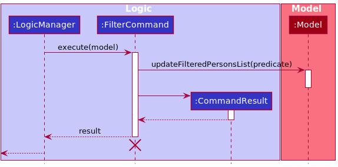

<div markdown="span" class="alert alert-info">:information_source: **Note:** The lifeline for `ProfileCommandParser` and `ProfileCommand` should end at the destroy marker (X) but due to a limitation of PlantUML, the lifeline reaches the end of diagram.
</div>

The existing functionality of Java's `FilteredList` is leveraged for the implementation of the command. The execution of the
`FindCommand` is near identical except to `FilterCommand` for the use of `NameContainsKeywordsPredicate` instead of
`PersonHasTagsPredicate`.

### History tracking features

We saw a need for Teletubbies to track the history of the application as a core feature while we were devising our user stories. This would allow users to traverse back
and regain access to previous states, as well as access previous commands.

The features that required the tracking of history were the
* `undo`/`redo` commands,
* `history` command, and
* Unix-style way of obtaining previous and next commands, using the **UP** and **DOWN**
arrow keys

The `HistoryManager` class was created to serve as an abstraction for devices that can store the history of any object. It's sole responsibility is to
manage the history of the type of object we wanted to track, including the current state and a list of previous states or previously undone states. It is a generic class, which
allows for efficient code re-usability.

`HistoryManager` uses a stack-like data structure, with a *Last-In, First-out* (LIFO) method of storing states.

`HistoryManager` contains an `ArrayList` called `historyStack` which serves as the stack-like data structure to store the states of the object in question, and a `stackPointer` which stores the
index of the current state in question.

When `HistoryManager` is first initialised, `historyStack` is empty while `stackPointer` does not point to any state, since there are none stored.

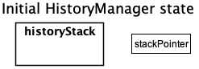

Then, new states of the object with type parameter `T` are added and stored in the `HistoryManager`, using `HistoryManager#commitAndPush(T item)`. This method causes the new item to be added to
`historyStack` and the `stackPointer` to be pointed to the new item.

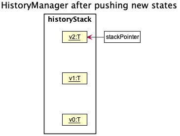

<div markdown="span" class="alert alert-info">:information_source: **Note:** `HistoryManager#commitAndPush(T item)` returns a *new* `HistoryManager` object which has the new state pushed to the top of the
`historyStack`. This ensures the immutability of historyStack and guarantees that if anything is added, `stackPointer` will point to the latest version.
</div>

The `HistoryManager#undo()` and `HistoryManager#redo()` methods allow the pointer to be pushed up or down to previous states or previously undone states, by simply pointing to the object below the current state or above it.

For instance, this is how `HistoryManager` looks like after `HistoryManager#undo()` is called twice:

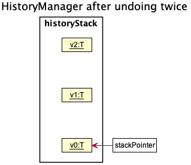

And after `HistoryManager#redo()` is called once, it looks like this:

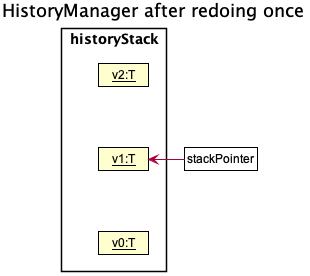

<div markdown="span" class="alert alert-info">:information_source: **Note:** `HistoryManager#undo()` and `HistoryManager#redo()` *do not* return new `HistoryManager` objects as the `historyStack` is not manipulated.
</div>

Calling `HistoryManager#commitAndPush(T item)` here causes the states above the `stackPointer` to be removed and replaced by the new state, as indicated by item.
Once again, a new `HistoryManager` is created, this time with the new state added and the state `v2` to be removed.

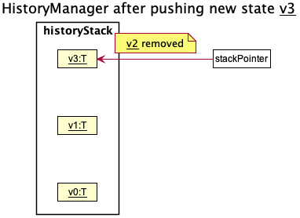

`HistoryManager` also has a `HistoryManager#peek()` method which returns the current state that is pointed at by the `stackPointer`, as well as the
`HistoryManager#resetFullHistory()` method which simply resets the `stackPointer` to point to the top of the `historyStack`.

#### Design Considerations

**Aspect: How can the previous states be stored**

* **Alternative 1 (current choice):** Use a single stack to record the history
  * Pros: Easy to visualise
  * Cons: Need to be careful while committing as both previous states and previously undone states exist on the same stack. Does not adhere closely to Single Responsibility Principle.

* **Alternative 2 (proposed):** Use a 2-stack method to record history, one which stores the states which can be undone and the other to store the states which can be redone.
  * The `HistoryManager` would originally have 2 stacks: an undo stack and a redo stack. Before actions are undone, the redo stack would be empty while the new states would be added
directly to the top of redo stack. 
    
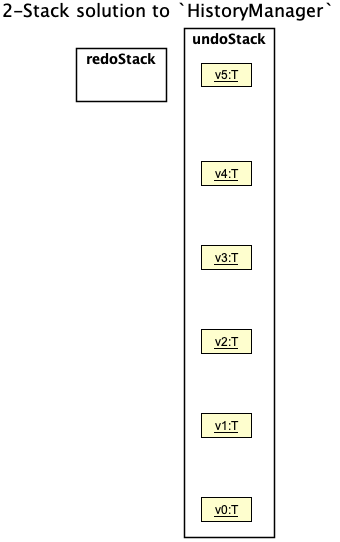

  * Then, as `HistoryManager#undo()` or `HistoryManager#redo()` is called states would be popped from one stack and pushed to the other. 
    
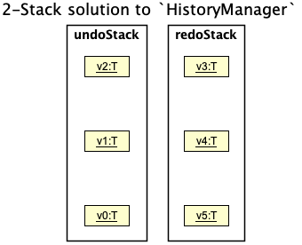

  * If we want to commit to `HistoryManager`, all we have to do is clear `redoStack` and push the new state to `undoStack`. 
    
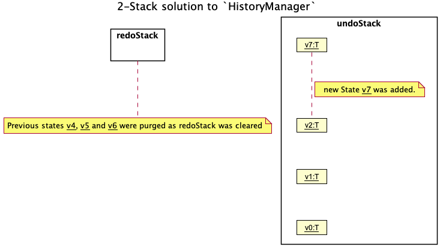

  * Pros: Single responsibility principle, `undoStack` only manages states to be undone while `redoStack` only manages states to be redone.
  * Cons: Difficult to visualise.


### Undo/Redo feature

The `undo` command allows the telemarketer or the supervisor to revert to previous states. This mechanism is supported by the `VersionedAddressBook`. `VersionedAddressBook` extends
`AddressBook`, but internally implements the `HistoryManager` class to store and track `ReadOnlyAddressBook`, the states of the address book.

It also implements the following methods:

* `VersionedAddressBook#commitCurrentStateAndSave()` - This action adds a copy of the current state to `HistoryManager`
* `VersionedAddressBook#commitWithoutSavingCurrentState()` - This action clears previously undone states stored by `HistoryManager`. This method will only be called
* `VersionedAddressBook#undo()` - This action restores a previously stored state as stored in `HistoryManager`
* `VersionedAddressBook#redo()` - This action restores a previously undone state as stored in `HistoryManager`

The `Model` interface also exposes methods such as `Model#undoAddressBook()`, `Model#redoAddressBook()` and `Model#commitAddressBook()` that allows the states to be changed.

An example of the usage scenario of `undo` is given below:

Step 1. Teletubbies is launched for the first time by the user. `VersionedAddressBook` is first initialised with an initial address book state.

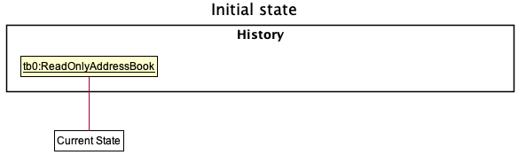

Step 2. The user changes the current state of Teletubbies by executing a `done 1` command. The `done` command calls `Model#commitAddressBook()` which in turn causes
`VersionedAddressBook#commitCurrentStateAndSave()` to be called. This causes the newest state of Teletubbies (which is different from it's previous state) to be
saved.

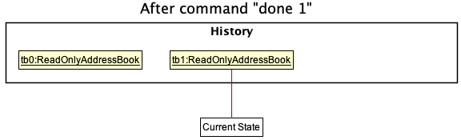

Step 3. The user changes the current state of Teletubbies by executing a `delete -i 1` command. The `delete` command calls `Model#commitAddressBook()` as before, causing
the state of Teletubbies to be changed.

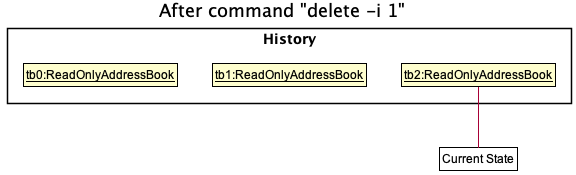

Step 4. The user decides to undo by executing `undo`. This causes `Model#undoAddressBook()` to be called, which causes `HistoryManager` to revert back to state `tb1`.

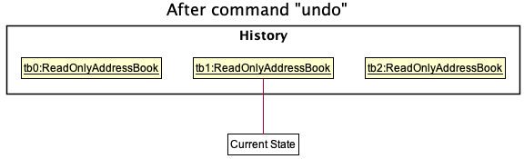

<div markdown="span" class="alert alert-info">:information_source: **Note:** If the current state is the earliest
possible state, in this case tb0, Teletubbies will no longer be revertible, and the undo command will throw an exception. The undo command uses
`Model#canUndoAddressBook()` to confirm if this is the case.
</div>

The sequence diagram below illustrates the undo operation:

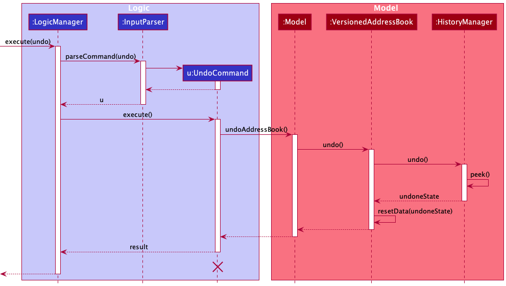

However, the `redo` command simply does the opposite and calls `Model#redoAddressBook()`, which causes the undone state to be reinstated.

<div markdown="span" class="alert alert-info">:information_source: **Note:** If the current state is the latest
possible state, in this case tb2, Teletubbies will no longer be able to restore undone states, and the redo command will throw an exception. The undo command uses
`Model#canRedoAddressBook()` to confirm if this is the case.
</div>

Step 5. The user decides to execute the command `find Alex`. However, `find` does not modify `VersionedAddressBook`. Commands that do not modify `VersionedAddressBook` do not call
`Model#commitAddressBook()` which allows the history of states to remain unchanged.

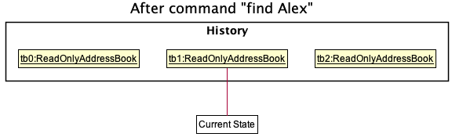

Step 6. The `clear` command is then executed by the user. `Model#commitAddressBook()` is called by the command, which causes the states after the current state to no longer be stored.

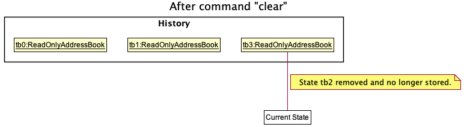

#### Design Considerations

**Aspect: How `undo` and `redo` would be executed**

* **Alternative 1 (current choice):** Just save the entire AddressBook state.
  * Pros: Easier to implement, debug and trace together
  * Cons: Very memory-intensive as multiple states and copies are stored.

* **Alternative 2:** Only store the difference in the AddressBook states, much like GitHub's approach to version control. This means a separate data structure which stores the difference between states like a tree is needed.
  * Pros: Much less memory-intensive since only differences between each version are saved
  * Cons: Difficult to implement a tree-like data structure that can effectively track the changes within the given time period. Undo would simply be a traversal up the tree while redo would be traversing down. Cannot reuse `HistoryManager`

### History feature

The `history` command allows the user to view the previous commands that were given to Teletubbies. This mechanism is supported by `CommandInputHistory`, which internally implements `HistoryManager`
to store and track user inputs which are `String`s.

`CommandInputHistory` also implements the following methods:

* `CommandInputHistory#getChronologicallyAscendingHistory()` - This method returns a List of Strings which are the commands keyed in by the user
in chronological order, i.e. the first element is the earliest command given by the user.
* `CommandInputHistory#getChronologicallyDescendingHistory()` - This method returns a List of Strings which are the commands keyed in by the user
in chronologically descending order, i.e. the first element is the latest command given by the user.
* `CommandInputHistory#addCommandInput(String input)` - This method calls `HistoryManager#resetFullHistory()` before calling `HistoryManager#commitAndPush()` to add a new String
to the `HistoryManager`. This is necessary as `CommandInputHistory` should keep track of all inputs without overwriting them.

The `Model` interface also exposes methods such as `Model#addCommandInput()`, `Model#getNextCommand()` and `Model#getPreviousCommand()` that allows access to the previous and next commands
as stored by the `HistoryManager` in `CommandInputHistory`.

The sequence diagram below shows the mechanism in storing the input given by the user.

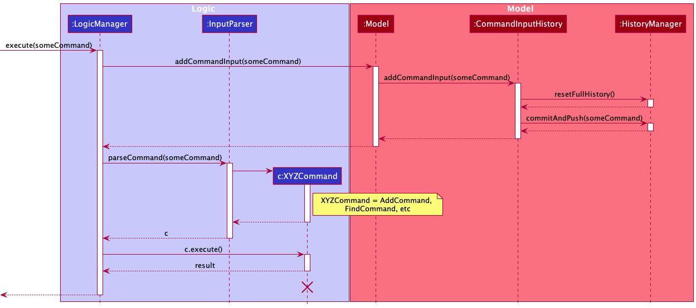

This allows the command to be stored regardless of the outcome of the command, even if it is an invalid command.

The sequence diagram below shows the execution path which is taken by the `history` command.

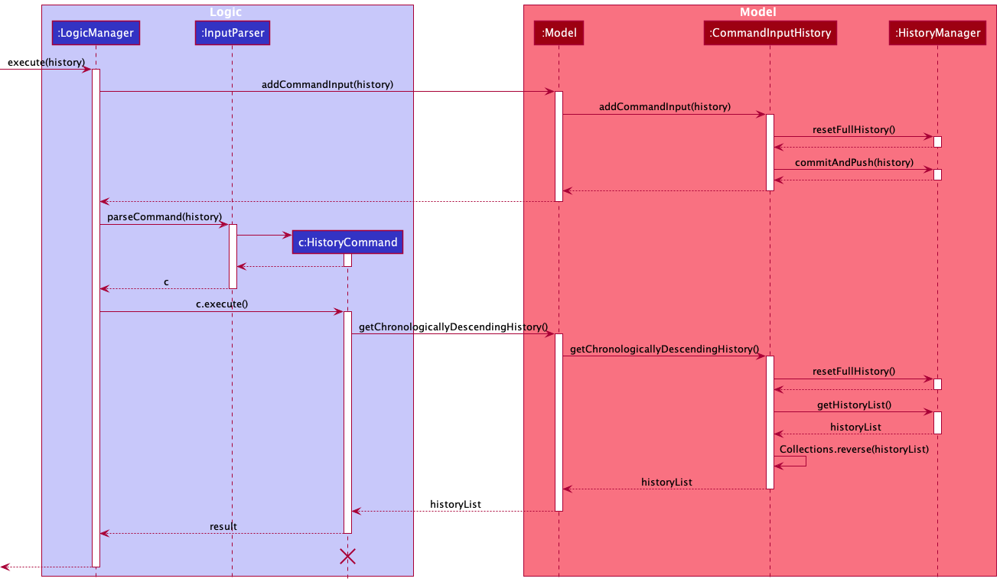

### Use of **UP** and **DOWN** to get previous or next commands

As we were inspired heavily by the elegance of Unix-like systems and their ability to cycle through previously input commands,
we decided to implement this as well. This feature is facilitated by the `Model` and `CommandHistoryInput`.

The UI component uses EventHandlers that detects if the **UP** or **DOWN** buttons are pressed by the user. Then, UI calls upon `Model#getPreviousCommand()`
or `Model#getNextCommand()` to get the previous or next command as stored by `CommandInputHistory`.

The activity diagram below show how the **UP** button key press is handled.

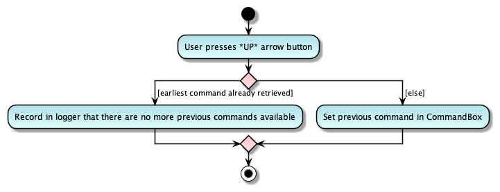

The activity diagram below show how the **DOWN** button key press is handled.

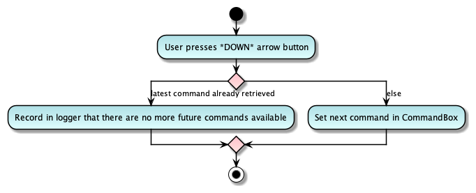

#### Design Considerations

**Aspect: The interaction between `UI` and `CommandInputHistory`**

* **Alternative 1 (current choice):** Let `Model` house `CommandInputHistory`
    * Pros: Minimal dependency between `Logic` and the components of `Model`
    * Cons: Additional dependency between `UI` and `Model` created as `UI` needs to call `Model` methods

* **Alternative 2:** Let `Logic` house `CommandInputHistory`
    * Pros: Since `Logic` already interacts with `UI`, no additional coupling created between them.
    * Cons: Requires passing of `CommandInputHistory` to `InputParser` in order to handle `history` commands. The parser should not
  have to know about `CommandInputHistory`

### Auto completion feature

Since Teletubbies is designed to be mainly used through its CLI, we prioritised the convenience of our users in typing
out commands by implementing an auto completion feature.

The autocompletion mechanism is facilitated by the `CommandMap` class. The `CommandMap` contains a a `HashMap`
called `classMap` which stores the individual command words as keys and the `XYZCommand` classes as values. Within
each `XYZCommand` class, the recommended command fields for the command are stored in a `List` called `RECOMMENDED_FLAGS`.
This list is not stored if the command does not require command fields. Here, `XYZ` is a placeholder for the specific
command name, e.g. `AddCommand`.

The UI component uses EventHandlers that detects if the **TAB** button is pressed by the user. Then, UI calls
upon `CommandMap#getClass()` to retrieve the class that corresponds to the input command, which then prints out
the command fields specified within the `RECOMMENDED_FLAGS` list (or does not print out anything, in the case that no command fields
are required for the input command).

--------------------------------------------------------------------------------------------------------------------

## **Documentation, Logging, Testing, Configuration, Dev-ops**

* [Documentation guide](Documentation.md)
* [Testing guide](Testing.md)
* [Logging guide](Logging.md)
* [Configuration guide](Configuration.md)
* [DevOps guide](DevOps.md)

--------------------------------------------------------------------------------------------------------------------

## **Appendix: Requirements**

### Product scope

#### **Target User Profiles**


David Wong
* works as a **telemarketer** from home and makes internet calls on his computer
* likes to import/export data quickly
* wants to mark the contacts that he has already called and/or successfully marketed to
* wants to keep track of his progress
* has a need to manage a significant number of contacts
* prefer desktop apps over other types
* can type fast
* prefers typing to mouse interactions
* is reasonably comfortable using CLI apps

<br>

Anne Goh
* works as a **telemarketing supervisor** from home
* needs to pass lists of contacts to her subordinates to contact
* wants to monitor the performance of her subordinates
* has a need to manage a significant number of contacts
* prefer desktop apps over other types
* can type fast
* prefers typing to mouse interactions
* is reasonably comfortable using CLI apps

<br>

#### **Value Proposition**

* Able to import / export data into an easy-to-view format, useful for those who are not experienced at working with data files such as JSON / CSV / etc.
* Easy to add/annotate details on users to keep track of user defined metrics
* Ability to get analytics about metrics for progress-tracking


### User stories

Priorities:
* High (must have) - `* * *`
* Medium (nice to have) - `* *`
* Low (unlikely to have) - `*`

| Priority | As a …​                              | I want to …​                                          | So that I can…​                                                                     |
| -------- | --------------------------------------- | -------------------------------------------------------- | -------------------------------------------------------------------------------------- |
| `* * *`  | Telemarketer                            | import the list of customers                             | easily view all the contacts I need to call                                            |
| `* * *`  | Telemarketer                            | export the list of customers                             | send the list to my supervisor                                                         |
| `* * *`  | Telemarketing Supervisor                | merge my employees' customer lists                       | easily view the contacts completion status of my subordinates                          |
| `* * *`  | Telemarketing Supervisor                | export the list of customers                             | send the list to my subordinates for them to complete                                  |
| `* * *`  | Telemarketer / Telemarketing Supervisor | save data from current session                           | save my current progress to continue during the next session                           |
| `* * *`  | Telemarketer / Telemarketing Supervisor | load data from previous session                          | pick up where I left off from my previous session                                      |
| `* * *`  | Telemarketer                            | indicate my name under 'profile'                         | identify myself in progress reports for my supervisor                                  |
| `* * *`  | Telemarketer / Telemarketing Supervisor | indicate my role under 'profile'                         | get access to the functionalities that cater to my specific job                        |
| `* * *`  | Telemarketer                            | mark a contact as completed                              | see that I have already called a contact successfully                                  |
| `* * *`  | Telemarketer                            | click to copy the contact's phone number to my clipboard | easily transfer it to my calling app                                           |
| `* * *`  | Telemarketer                            | add remarks to my contacts                               | store additional long-form information about specific contacts                         |
| `* * *`  | Telemarketing Supervisor                | add a contact                                            | add contacts that need to be called by my subordinates                                 |
| `* * *`  | Telemarketing Supervisor                | delete a contact                                         | remove contacts that no longer need to be tracked or have been added wrongly           |
| `* * *`  | Telemarketer / Telemarketing Supervisor | view progress on the contacts in a simple chart          | so that I can easily get help whenever I need it without losing focus                  |
| `* * *`  | Telemarketer / Telemarketing Supervisor | undo or redo previously made changes                     | revert any possible mistakes made                                                      |
| `* * *`  | Telemarketer / Telemarketing Supervisor | tag contacts with additional information                 | get useful analytics on specific contacts and include useful information like assignee |
| `* * *`  | Telemarketer / Telemarketing Supervisor | filter entries by tag                                    | focus my view of contacts                                                              |
| `* *`    | Telemarketer / Telemarketing Supervisor | view the user guide from the app                         | easily get help whenever I need it without losing focus                                |
| `* *`    | Telemarketer / Telemarketing Supervisor | use up-down arrows to access command history             | repeat previous commands without needed to type it out again                           |
| `* *`    | Telemarketer / Telemarketing Supervisor | preview and confirm the contacts I'm exporting           | reduce export mistakes                                                                 |
| `*`      | Telemarketer / Telemarketing Supervisor | press tab to autofill recommended tags                   | quickly fill out flags without needing to check the user guide                         |
| `*`      | Telemarketer / Telemarketing Supervisor | view my command history                                  | trace previously entered commands at a glance                                          |


*{ More to be added as new features are introduced }*

### Use cases

| Use Case ID  | Description                            |
| -----------  | -------------------------------------- |
| [UC01](#uc01-supervisor-adds-a-contact) |     Supervisor adds a contact                 |
| [UC02](#uc02-supervisor-deletes-a-contact) |     Supervisor deletes a contact                      |
| [UC03](#uc03-supervisor-tags-a-contact) |     Supervisor tags a contact                     |
| [UC04](#uc04-telemarketer-sets-a-person-as-done) |      Telemarketer sets a person as done           |
| [UC05](#uc05-telemarketer-adds-a-remark-to-a-person) |    Telemarketer adds a remark to a person |
| [UC06](#uc06-telemarketer-imports-a-customer-list-from-supervisor) |    Telemarketer imports a customer list from supervisor          |
| [UC07](#uc07-telemarketer-exports-a-customer-contact-file) |      Telemarketer exports a customer contact file                |
| [UC08](#uc08-telemarketer-undoes-teletubbies) |     Telemarketer undoes Teletubbies   |
| [UC09](#uc09-telemarketer-redoes-teletubbies) |       Telemarketer redoes Teletubbies           |
| [UC10](#uc10-telemarketer-checks-command-history) |       Telemarketer checks Command History                   |
| [UC11](#uc11-user-views-the-help-page) |     User views the help page                  |

For all use cases below, the **System** is the `Teletubbies` application, and the **Actor** is the user, unless specified otherwise.

#### UC01: Supervisor adds a contact

**MSS**

1. User adds a contact.
2. Teletubbies adds the contact to the contact list.

   Use case ends.

**Extensions**

* 2a. Flags are missing for the command / Fields are invalid / Compulsory fields are empty.
  
  * 2a1. Teletubbies shows an error message.

    Use case ends.

* 2b. There is an existing contact with the same phone number being added.

  * 2b1. Teletubbies shows an error message.
  
    Use case ends.

*a. At any time, User chooses to undo [UC08](#uc08-telemarketer-undoes-teletubbies) or redo [UC09](#uc09-telemarketer-redoes-teletubbies).

#### UC02: Supervisor deletes a contact

**MSS**

1.  User requests to list contact.
1.  Teletubbies shows a list of contacts.
1.  User requests to delete a specific contact in the list.
1.  Teletubbies deletes the contact.

    Use case ends.

**Extensions**

* 2a. The list is empty.

  Use case ends.

* 3a. The given index is invalid or the given phone number does not exist.

    * 3a1. Teletubbies shows an error message.

      Use case resumes at step 2.

*a. At any time, User chooses to undo [UC08](#uc08-telemarketer-undoes-teletubbies) or redo [UC09](#uc09-telemarketer-redoes-teletubbies).


#### UC03: Supervisor tags a contact

**MSS**

1. User requests to list contact.
2. Teletubbies shows a list of contacts.
3. User requests to tag a specific contact with a name and value.
4. Teletubbies tags the contact appropriately.

    Use case ends.

**Extensions**

* 3a. Teletubbies detects an invalid user input in the tag command.

  * 3a1. Teletubbies displays an error message.
  
    Use case ends.

*a. At any time, User chooses to undo [UC08](#uc08-telemarketer-undoes-teletubbies) or redo [UC09](#uc09-telemarketer-redoes-teletubbies).

#### UC04: Telemarketer sets a person as done

**MSS**

1. User requests to mark a contact as done.
2. Teletubbies sets the completed status of the contact as `COMPLETE`.

    Use case ends.

**Extensions**

* 1a. The specified contact index is invalid.

  * 1a1. Teletubbies shows an error message.

    Use case resumes at step 1.

*a. At any time, User chooses to undo [UC08](#uc08-telemarketer-undoes-teletubbies) or redo [UC09](#uc09-telemarketer-redoes-teletubbies).

#### UC05: Telemarketer adds a remark to a person

**MSS**

1. User requests to add a remark to a contact.
2. Teletubbies adds the remark to the contact.

   Use case ends.

**Extensions**

* 1a. The specified contact index is invalid.
  
  * 1a1. Teletubbies shows an error message.
  
    Use case ends.

* 1b. The remark is over the 40 character limit.

  * 1b1. Teletubbies shows an error message.
  
    Use case ends.

*a. At any time, User chooses the view help (UC11).
*b. At any time, User chooses to undo [UC08](#uc08-telemarketer-undoes-teletubbies) or redo [UC09](#uc09-telemarketer-redoes-teletubbies).

#### UC06: Telemarketer imports a customer list from supervisor

**MSS**

1. User starts up the Teletubbies desktop application.
2. User selects and imports the JSON file containing the list of contacts for the shift from a file location.
3. Teletubbies displays the imported contacts.
4. User copies a customer’s contact number and makes the phone call.
5. User marks the customer as completed.
6. Teletubbies saves the file and displays that the call for the contact is completed.

    Use case ends.

**Extensions**

* 3a. Teletubbies does not detect a JSON file in the specified file path.

    * 3a1. Teletubbies displays a message prompting the Telemarketer to try importing the JSON file again.
    * 3a2. Telemarketer imports a JSON file containing the customers’ details.
  
      Steps 3a1 to 3a2 are repeated until a valid JSON file is selected.

      Use case resumes from step 4.

* 3b. Teletubbies detects that the JSON file selected is not in the correct format.

    * 3b1. Teletubbies displays a message informing the Telemarketer that the file is not in the correct format.
    * 3b2. Telemarketer informs their Supervisor about the error.

      Use case ends.

* 5a. Teletubbies detects that the index used in the command is invalid.
    * 5a1. Teletubbies displays a message to inform Telemarketer about the input error.
    * 5a2. Telemarketer re-enters the command with a correct index number for the contact.
      
      Steps 5a1 to 5a2 are repeated until a valid customer phone number is input.

      Use case resumes from step 6.

*a. At any time, User chooses to undo [UC08](#uc08-telemarketer-undoes-teletubbies) or redo [UC09](#uc09-telemarketer-redoes-teletubbies).

#### UC07: Telemarketer exports a customer contact file

**MSS**

1. User enters the `export` command.
2. Teletubbies requests for confirmation for export.
3. User confirms request to export.
4. Teletubbies opens the file chooser window.
5. User selects a directory to export to.
6. Teletubbies exports the customer contact list.
   
   Use case ends.

**Extensions**

* 1a. User chooses to export contacts with a specific tag.
  
  * 1a1. Teletubbies displays the contact list with the specified tags.
  
    Use case resumes at step 2.

* 3a. User enters an invalid command.

  * 3a1. Teletubbies cancels the request to export.
  
    Use case ends.

*a. At any time, User chooses to undo [UC08](#uc08-telemarketer-undoes-teletubbies) or redo [UC09](#uc09-telemarketer-redoes-teletubbies).

#### UC08: Telemarketer undoes Teletubbies

**MSS**
1. User enters the `undo` command.
2. Teletubbies undoes to the previous state.
   
   Use case ends.

**Extensions**

* 1a. Teletubbies is in its earliest possible state.
  
  * 1a1. Teletubbies shows an error message:  “Teletubbies is currently at its earliest version and cannot be reverted.”.

*a. At any time, User chooses to undo [UC08](#uc08-telemarketer-undoes-teletubbies) or redo [UC09](#uc09-telemarketer-redoes-teletubbies).

#### UC09: Telemarketer redoes Teletubbies

**MSS**
1. User enters the `redo` command.
2. Teletubbies redoes to the previously undone state.
   
   Use case ends.

**Extensions**

* 1a. Teletubbies is in its latest possible state.

  * 1a1. Teletubbies shows an error message:  “Teletubbies is currently at its latest version and cannot be redone.”.

*a. At any time, User chooses to undo [UC08](#uc08-telemarketer-undoes-teletubbies) or redo [UC09](#uc09-telemarketer-redoes-teletubbies).

#### UC10: Telemarketer checks Command History

**MSS**
1. User enters the `history` command.
2. Teletubbies shows the recently keyed-in commands in chronologically-reverse order, with the latest command at the top after history.

   Use case ends.

**Extensions**

*a. At any time, User chooses to undo [UC08](#uc08-telemarketer-undoes-teletubbies) or redo [UC09](#uc09-telemarketer-redoes-teletubbies).

#### UC11: User views the help page

**MSS**
1. User enters the help command.
2. Teletubbies displays the user guide in a web view.
   
    Use case ends.

**Extensions**

*a. At any time, User chooses to undo [UC08](#uc08-telemarketer-undoes-teletubbies) or redo [UC09](#uc09-telemarketer-redoes-teletubbies).

### Non-Functional Requirements
1. New telemarketers should be able to easily use the application. (**Quality requirement**)
2. The application should save and load data fast, and startup should take a few seconds at the most. (**Performance requirement / Response time**)
3. Data should be saved frequently and automatically to allow for easy recovery on possible crashes. (**Disaster recovery**)
4. The product should work on all OS, and both 32-bit and 64-bit environments. (**Technical / Environment requirement**)
5. The application should be able to efficiently (without a noticeable slowdown) handle standard operations (add, delete, search, etc) for up to 10,000 users. (**Data requirement**, ie. volatility)
6. The product project is expected to adhere to a schedule that delivers a feature set every two weeks. (**Process requirements**)
7. The product is not required to handle in-app sharing of data across users on different devices. (**Project scope**)
8. The product should be available for potential testers to test the capabilities of the product / find any bugs or issues. (**Testability**)

--------------------------------------------------------------------------------------------------------------------

## **Appendix: Instructions for manual testing**

Given below are instructions to test the app manually.

<div markdown="span" class="alert alert-info">:information_source: **Note:** These instructions only provide a starting point for testers to work on;
testers are expected to do more *exploratory* testing.

</div>

### Launch and shutdown

1. Initial launch

1. Download the [jar file](https://github.com/AY2122S1-CS2103T-W15-4/tp/releases) and copy into an empty folder

1. Double-click the jar file Expected: Shows the GUI with a set of sample contacts. The window size may not be optimum.

1. Saving window preferences

1. Resize the window to an optimum size. Move the window to a different location. Close the window.

1. Re-launch the app by double-clicking the jar file.<br>
   Expected: The most recent window size and location is retained.

### Managing contacts

#### Deleting a contact

1. Deleting a contact with the correct command format, **by referencing their index while all persons are being shown**
   1. Prerequisites: List all contacts using the `list` command. Multiple contacts in the list.
   2. Test case: `delete -i 1`<br>
      * Expected: First contact is deleted from the list. Details of the deleted contact shown in the status message. Pie chart will be updated to reflect the progress of the updated contact list.
   3. Test case: `delete -i 0`<br>
      * Expected: No contact is deleted. Error details shown in the status message. Pie chart remains the same
   4. Other incorrect delete commands to try: `delete`, `delete -i x`, `...` (where `x` is larger than the list size)<br>
      * Expected: Similar to previous.
2. Deleting a contact with the correct command format, **by referencing their phone number** while all contacts are being shown
   1. Prerequisites: List all contacts using the list command, Multiple contacts in the list.
   2. Test case: `delete -p 87654321`
      * Expected: Assuming a contact with phone number 87654321 exists, that contact is deleted from the list. Details of the deleted contact shown in the status message. Pie chart will be updated to reflect the progress of the updated contact list.
   3. Test case: `delete -p 11111111`
      * Expected: Assuming a contact with phone number 11111111 does not exist, no contact is deleted. Pie chart remains the same.

#### Adding a contact

1. Adding a contact with the correct command format
    1. Prerequisites: None.
    2. Test case: `add -n John Doe -p 87654321`
       * Expected: A contact named “John Doe” with phone number 87654321 will be added into the contact list. The pie chart will be updated to reflect the progress of the updated contact list.
    3. Test case: `add -n Albert Saw -p 98765432 -e albertsaw@gmail.com -a Tampines Street 23, Block 777, #05-12`
       * Expected: A contact named “Albert Saw” with phone number 98765432, email address “albertsaw@gmail.com” and address “Tampines Street 23, Block 777, #05-12
       “ will be added into the contact list.
2. Adding a contact with an incorrect command format
    1. Prerequisites: None.
    1. Test case: `add -n John Doe -e johndoe@gmail.com`
       * Expected: No contact is added. Error details are shown in the status message.

#### Editing a contact

1. Editing a contact with the correct command format
    1. Prerequisites: List all contacts using the list command, Multiple contacts in the list
    1. Test case: `edit 1 -n Regina Phalange -p 999`
       * Expected: The first contact in the list has name set to “Regina Phalange” and phone	number 999
1. Editing a contact with an incorrect command format (wrong email format)
    1. Prerequisites: List all contacts using the list command, Multiple contacts in the list
    1. Test case: `edit 1 -e help@`
       * Expected: Error message detailing correct expected email format
1. Editing a contact with an incorrect command format (wrong phone number format)
    1. Prerequisites: List all contacts using the list command, Multiple contacts in the list
    1. Test case: `edit 1 -p 99`
       * Expected: Error message explaining phone number should be at least 3 digits long

#### Adding a remark to a contact

1. Adding a remark to a contact with the correct command format (with `-r` flag)
    1. Prerequisites: List all contacts using the list command, Multiple contacts in the list
    2. Test case: `remark 1 -r Need to call back`
       * Expected:  A remark “Need to call back” is added to the first contact in the list.
    3. Test case: `remark 1 -r `
       * Expected: Assuming that the contact has an existing remark, the existing remark is removed from the contact.
2. Adding a remark to a contact with the correct command format (with no `-r` flag)
    1. Prerequisites: List all contacts using the list command, Multiple contacts in the list, contact at index 1 with remark: ‘Call back at 2pm’
    2. Test case: remark 1 
       * Expected: A message is shown that the remark has been removed from the first person on the contact list.
    3. Test case: `remark 1 remark`
       * Expected: Error message about command format
3. Other incorrect remark commands to try: `remark `, `remark  -r x`, `...` (where `x` is larger than the list size or a negative number)<br>

#### Tagging and removing tag from contact

1. Adding a tag to a range of contacts with the correct command format
    1. Prerequisites: List all contacts using the list command, At least 6 contacts in the list
    2. Test case: `tag 1-4 -n Assignee -v Ken`
       * Expected: A success message with the first 4 contacts in the list with the `Assignee: Ken` tag
    3. Other correct inputs to try:
       1. Comma separated indices (e.g. `tag 1,2,3,4 -n Assignee -v Ken`)
       2. Range with single value (e.g. `tag 1 -n Assignee -v Ken`)
       3. Name and no value (e.g. tag 1-4 -n IMPORTANT)
2. Adding a tag with incorrect command format (with value and no name)
    1. Prerequisites: List all contacts using the list command, Non-empty contact list
    1. Test case: `tag 1 -v TEST`
       * Expected: Error message about command format
3. Removing a tag from a range of contacts with correct command format (with name and value)
    1. Prerequisites: List all contacts using the list command, Contact list must be of length at least 6, and contacts at index 1, 3, and 5 with the tag `priority:IMPORTANT`
    1. Test case: `tagrm 1-6 -n priority -v IMPORTANT`
       * Expected: No contact from index 1 to 6 (inclusive) should have the `priority: IMPORTANT` tag
4. Removing a tag from a range of contacts with correct command format (with name and no value)
    1. Prerequisites: List all contacts using the list command, Contact list must be of length at least 6, with the contacts at index 1, 3, and 5 with the tag `priority:IMPORTANT`, and contact at index 2 with the tag `priority: LOW`
    1. Test case: `tagrm 1-6 -n priority`
       * Expected: No contact from index 1 to 6 (inclusive) should have a tag with the name `important`, including `priority: IMPORTANT` and `priority: LOW`.

### Setting Profile

1. Setting the user profile with the correct command format
    1. Prerequisites: None.
    1. Note: Between test cases for the `profile` command, set the field `isProfileSet` to false in the `preferences.json` file, which can be found in the same folder as `teletubbies.jar`.
    1. Test case: `profile -n John Doe -role Telemarketer`
       * Expected: A success message showing the user’s newly set name and role
    1. Test case: `profile -n John Boe -role Supervisor`
       * Expected: A success message showing the user’s newly set name and role
    1. Test case: `profile -n -role Telemarketer`
       * Expected: A success message showing the user’s newly set name (empty) and role

### Importing, Exporting and Merging contacts
1. If you have been using the app prior to this, exit the app and delete the contacts file `[JAR file location]/data/teletubbies.json`.
2. Launch the Teletubbies app by double-clicking the jar file.
3. Export contacts with a specified tag
   1. Prerequisites: Contacts list contains the sample data set.
   2. Test case: `export -t ProductB`
      * Expected: The contact list would contain contacts that have the tag “ProductB”. There would also be a message requesting user confirmation for export.
   3. Test case: `y` (continued)
      * Expected: File chooser window opens.
   4. Test case: Choose a file location and name file
      * Expected: A success message showing that the export was successful. Original contact list is displayed
4. Import contacts from a file
   1. Prerequisite: Completed the Export test case above or have a correctly formatted contact data file
   2. Test case: `import`
      * Expected: File chooser window opens.
   3. Test case: Choose the file to import
      * Expected: A success message showing that the import was successful. Contact list is updated with contacts from the imported file.
5. Merge contacts from a file
   1. Prerequisite: Contact list has a few contacts. Export a subset of the contacts and make changes to the JSON file (E.g. change their particulars) ensuring that the JSON formatting remains correct
   2. Test case: `merge`
      * Expected: File chooser window opens.
   3. Test case: Choose the file to merge
      * Expected: A success message showing that the merge was successful. Contacts that were originally in the list are updated with the changes made in the merged list. Contacts that were not in the merged list remain unchanged.
   4. Other incorrect commands to try: Closing the file selector window


### `undo` / `redo`
1. If you have been using the application before this, exit the app
2. Launch the application by double-clicking on the jar file.
    1. Prerequisites: None.
    2. Test case: `undo`
        * Expected: An error message which says “Teletubbies is currently at its earliest version and cannot be reverted.”
    3. Test case: Clear the Teletubbies application by pressing `clear` and type `undo`
       * Expected: The application reverts back to the state before the `clear` command was input.
    4. Test case: `undo`
        * Expected: An error message which says “Teletubbies is currently at its earliest version and cannot be reverted.”
    5. Test case: `redo`
        * Expected: The empty teletubbies application which was present after `clear`
    6. Test case: `redo`
        * Expected: An error message which says “Teletubbies is currently at its latest version and cannot be redone.”
    7. Test case: Enter 3 unique commands of either `add`, `delete`, `tag`, `done`, `remark` and take note of the order. These are some of the Contact Commands that you can type to modify contacts
   Key in `undo` 3 times, and after each `undo` is keyed in, verify that the state corresponds with the state from before.
        * Expected: All states are verified to be accurate
    8. Test case: Enter one command of either `add`, `delete`, `tag`, `done` or `remark` and ensure that a previous command was not keyed in.
   Key in `undo` twice. 
        * Expected: The first `undo` command would return a Teletubbies state which corresponds to the state it was in when it originally started. The second `undo` command should return an error message which says “Teletubbies is currently at it's earliest version and cannot be reverted.”
    9. Test case: Enter `redo` twice
        * Expected: The first `redo` command returns the Teletubbies state which was present after 7a was executed. The second `redo` command should return an error message which says “Teletubbies is currently at it's latest version and cannot be redone.”

### `history`

1. Prerequisite: Enter at least 5 commands after starting up the application and remember the order in which the commands were keyed in.
2. Test case: Key in `history`
   * Expected: a list of commands keyed in chronologically descending order, with history at the top.

### Key bindings ([UP], [DOWN] and [TAB])

1. [UP], and [DOWN] arrows keys to navigate command history
    1. Prerequisite: Enter at least 5 unique commands after starting up the application
    2. Test case: Pressing the [UP] and [DOWN] keys in some order, making sure to press [UP] more than 5 times, and [DOWN] more than 5 times in a row
       * Expected: The command box text should correspond with the appropriate commands in the command history (viewable with the `history` command). [UP] should show a previous command and [DOWN] should show a later command. If the first command is showing [UP] should not change the command box text. If the last command is showing, [DOWN] should not change the command box text.
1. [TAB] key to autocomplete command flags
    1. Test case: Type the command `add` (or another command) and press [TAB]
       * Expected: The command box text should show the command word, with the recommended flags. For add, it should show: `add -n -p -e -a`


--------------------------------------------------------------------------------------------------------------------

## **Appendix: Effort**

Teletubbies started out as a brownfield project that extended from AB3, and aimed to evolve it into an optimized contact manager application for a specific target audience (i.e. Telemarketers and Telemarketing supervisors).

Our team has put in a significant amount of effort during the development of Teletubbies. We currently have a total of over [10,000 lines of code contributed](https://nus-cs2103-ay2122s1.github.io/tp-dashboard/?search=W15-4&sort=groupTitle&sortWithin=title&timeframe=commit&mergegroup=&groupSelect=groupByRepos&breakdown=true&checkedFileTypes=docs~functional-code~test-code~other&since=2021-09-17), and over 300 automated tests.

Through the development period, we have made significant progress in terms of new features and enhancements. Listed below are the achievements of our brownfield project, and the challenges that we faced during development.

### Project Achievements & Challenges

1. **Enhancement of the CLI**

As Teletubbies is a CLI-based application, we implemented various enhancements to the CLI, including:

* Ability to view command history
* Ability to access previous / next commands in the command history through **up** and **down** arrows
* Ability to auto-complete commands
* Ability to `undo` and `redo` commands

The functionality of these commands were highly influenced by UNIX CLI. While the implementation of the command history and auto-complete features were not as complex, they nevertheless posed a moderate amount of challenge as we had to implement them from scratch.

Moreover, the implementations of `undo` and `redo` commands were more complex than we initially thought, as we wanted the undo and redo features to revert back any changes made to the application as a whole. Hence, we had to develop a way to store the state for the entire application and manage the different stored states over a single session, which took some time to even conceptualise (with discussions on various edge cases), and posed a significant challenge to implement.

2. **Enhancement of the GUI**

While Teletubbies is a CLI-based application, it nevertheless uses a GUI for the users to interact with. Hence, we implemented various enhancements to the GUI as well:

* Overhaul of the GUI
* Ability to view progress of each contact as a progress bar
* Ability to view the aggregate progress of the entire contact list as a pie chart
* Ability to copy the phone number from a contact using a clipboard button
* Ability to view the User Guide in a web view directly from the application

The first GUI change that was made was the `help` feature. The original AB3 application simply had the help button show a copyable link to the User Guide, which was not very user-friendly. Hence, we decided to implement a web view of the User Guide within the application itself, as it seemed to be rather straightforward. However, this posed challenges not in terms of the actual implementation, but rather in terms of understanding the JavaFX mechanics, and as a result we spent some time on trying to resolve some JavaFX-related issues.

As an app that tracks progress of each contact within a list of contacts, we also decided that the ability to view individual contact progress and the total progress over the current contact list as part of the GUI would be crucial. Hence, we implemented a progress bar and a pie chart respectively, which again posed some level of challenge in terms of learning the JavaFX architecture and the syntax, but was not overly complex to implement. Finally, in order to seamlessly incorporate these features into our application, we had to overhaul the GUI layout in order to fit these features in.

3. **Implementation of Teletubbies-specific Features**

* Ability to `import` / `export` / `merge` contact lists in JSON format
* Ability to set user profile
* Reworked tagging system separate from the `add` and `edit` commands
* Ability to add remarks to contacts
* Ability to `filter` the list based on tags

The main challenge we faced when transforming AB3 into Teletubbies was the interaction of the contact list data with the application itself. Hence, we had to spend a considerable amount of time discussing the architecture and the implementation of the `import` / `export` features, and eventually, we decided to expand the `import` feature into two separate features: `import` and `merge`.

Apart from the interaction of the application with the data files, we also reworked the existing systems and added in features that were Teletubbies-specific, such as the newly reworked tagging system that uses the `tag` and `tagrm` commands instead of the `add` and `edit` commands, the ability to add remarks to contacts via the `remark` command, filtering based on tags, and the ability for the user to set a profile that would determine the functionalities that the user has access to. The implementation for all these features also took some considerable amount of discussion and collaboration in order to ensure that all the features worked together seamlessly.

--------------------------------------------------------------------------------------------------------------------

## References 

The [Commands with UI effects](#commands-with-ui-effects) section was in part adapted from the Developer's Guide of
[CoLAB](https://ay2021s2-cs2103t-t11-2.github.io/tp/) from AY20/21 since their product had a feature involving very 
similar implementation considerations and diagrams.
