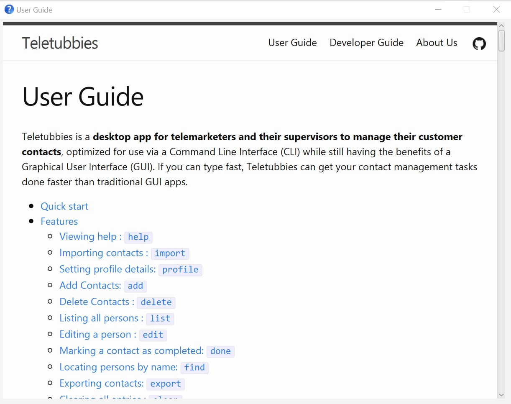
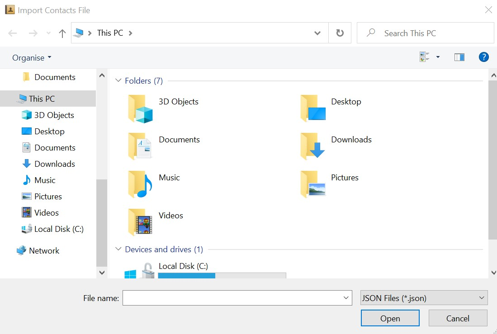

Teletubbies is a **desktop app for telemarketers and their supervisors to manage their customer contacts**, optimized for 
use via a Command Line Interface (CLI) while still having the benefits of a Graphical User Interface (GUI). If you can
type fast, Teletubbies can get your contact management tasks done faster than traditional GUI apps.

* Table of Contents
{:toc}

--------------------------------------------------------------------------------------------------------------------

## Quick start

1. Ensure you have Java `11` or above installed in your Computer.

1. Download the latest `teletubbies.jar` from [here](https://github.com/AY2122S1-CS2103T-W15-4/tp/releases).

1. Copy the file to the folder you want to use as the _home folder_ for your Teletubbies app.

1. Double-click the file to start the app. The GUI similar to the below should appear in a few seconds. Note how the app contains some sample data.  
     

1. Type the command in the command box and press Enter to execute it. e.g. typing **`help`** and pressing Enter will open the help window. 
   Some example commands you can try:

   * **`list`** : Lists all contacts.

   * **`add`**`n/John Doe p/98765432 e/johnd@example.com a/John street, block 123, #01-01` : Adds a contact named `John Doe` to Teletubbies.

   * **`delete`**`i/3` : Deletes the 3rd contact shown in the current list.
   
   * **`done`**`3` : Marks the 3rd contact shown in the current list as done.

   * **`clear`** : Deletes all contacts.

   * **`exit`** : Exits the app.

1. Refer to the [Features](#features) below for details of each command.

--------------------------------------------------------------------------------------------------------------------

## Features

**:information_source: Notes about the command format:** 

* Words in `UPPER_CASE` are the parameters to be supplied by the user. 
  e.g. in `add n/NAME`, `NAME` is a parameter which can be used as `add n/John Doe`.

* Items in square brackets are optional. 
  e.g `n/NAME [t/TAG]` can be used as `n/John Doe t/friend` or as `n/John Doe`.

* Items with `…`​ after them can be used multiple times or left blank. 
  e.g. `[t/TAG]…​` can be used as ` ` (i.e. 0 times), `t/friend`, `t/friend t/family` etc.

* Parameters can be in any order. 
  e.g. if the command specifies `n/NAME p/PHONE_NUMBER`, `p/PHONE_NUMBER n/NAME` is also acceptable.

* If a parameter is expected only once in the command but you specified it multiple times, only the last occurrence of the parameter will be taken. 
  e.g. if you specify `p/12341234 p/56785678`, only `p/56785678` will be taken.

* Extraneous parameters for commands that do not take in parameters (such as `help`, `list`, `exit` and `clear`) will be ignored. 
  e.g. if the command specifies `help 123`, it will be interpreted as `help`.

### Viewing help : `help`

Displays the User Guide in a pop-up window.

Format: `help`

### Importing contacts : `import`
Imports customer data into the application from a JSON file selected from the file selector window.

Format: `import`

Alternatively, click `File -> Import` in the top menu bar to open the file selector window. 

### Setting profile details: `profile`
Sets the name and role of the application user.

Both fields are mandatory, and the role can only be either "Telemarketer" or "Supervisor".

Format: `profile n/NAME r/ROLE`

Examples:
* `profile n/David Wong r/Telemarketer`
* `profile n/Anne Goh r/Supervisor`

### Adding a contact: `add`

Adds a customer to the application.

The customer’s name and phone number are mandatory. Address and email are optional fields.

Format: `add n/NAME p/PHONE_NUMBER [a/ADDRESS] [e/EMAIL] [t/TAG]…​`

:bulb: Tip:
A person can have any number of tags (including none)

Examples:
* `add n/John Doe p/98765432 a/John Street, block 123, #01-01 e/johnd@example.com t/friends`
* `add n/Betsy Crowe p/1234567`

### Deleting a contact : `delete`

Deletes the specified customer from the application.

Format: `delete p/PHONE_NUMBER` or `delete i/INDEX`

* Deletes the person at the specified `PHONE_NUMBER` or `INDEX`.
* The phone number must be associated with a customer in the application.  
* The index refers to the index number shown in the displayed person list.
* The index must be a positive integer 1, 2, 3, …​

Examples:
* `delete i/1`
* `delete p/87654321`

### Listing all contacts : `list`

Shows a list of all contacts in the application.

Format: `list`

### Editing a contact : `edit`

Edits an existing person in the application.

Format: `edit INDEX [n/NAME] [p/PHONE] [e/EMAIL] [a/ADDRESS] [t/TAG]…​`

* Edits the person at the specified `INDEX`. The index refers to the index number shown in the displayed person list. The index **must be a positive integer** 1, 2, 3, …​
* At least one of the optional fields must be provided.
* Existing values will be updated to the input values.
* When editing tags, the existing tags of the person will be removed i.e adding of tags is not cumulative.
* You can remove all the person’s tags by typing `t/` without
    specifying any tags after it.

Examples:
* `edit 1 p/91234567 e/johndoe@example.com` Edits the phone number and email address of the 1st person to be `91234567` and `johndoe@example.com` respectively.
* `edit 2 n/Betsy Crower t/` Edits the name of the 2nd person to be `Betsy Crower` and clears all existing tags.

### Marking a contact as completed: `done`

Edits and marks a person as 'Completed' in the application.

Format: `done INDEX`

* Marks the person at the specified `INDEX` as completed. The index refers to the index number shown in the displayed person list. The index **must be a positive integer** 1, 2, 3, …​
* At least one of the optional fields must be provided.
* Existing values will be updated to the input values.

Examples:
* `done 1`
* `done 2`

### Locating contacts by name: `find`

Finds persons whose names contain any of the given keywords.

Format: `find KEYWORD [MORE_KEYWORDS]`

* The search is case-insensitive. e.g `hans` will match `Hans`
* The order of the keywords does not matter. e.g. `Hans Bo` will match `Bo Hans`
* Only the name is searched.
* Only full words will be matched e.g. `Han` will not match `Hans`
* Persons matching at least one keyword will be returned (i.e. `OR` search).
  e.g. `Hans Bo` will return `Hans Gruber`, `Bo Yang`

Examples:
* `find John` returns `john` and `John Doe`
* `find alex david` returns `Alex Yeoh`, `David Li` 
  

### Exporting contacts: `export`

Exports customer data from the application to a JSON file in desired specified
folder selected from the file selector window.

Format: `export [t/TAGS ...]`

Examples:
`export t/ friends family` will export all contacts containing BOTH the
tags friends and family to the desired file location.

### Clearing all entries : `clear`

Clears all entries from the application.

Format: `clear`

### Listing your previous commands : `history`

Shows a list of previously typed commands from most recent to earliest.

Format: `history`

### Exiting the program : `exit`

Exits the program.

Format: `exit`

### Saving the data

Teletubbies automatically saves the data in the hard disk after any command that changes the data. There is no need to save manually.

For exporting the current data as a separate JSON file, refer to [Exporting contacts](#exporting-contacts-export).

### Loading the data

Teletubbies will automatically load up the data from your previous session, allowing you to pick up right where you left off. There is no need to load manually.

For importing a separate JSON file into the application, refer to [Importing contacts](#importing-contacts-import).

### Editing the data

Teletubbies will save the data as a JSON file `[JAR file location]/data/teletubbies-ddmmyyyy-hhmm.json`. Advanced users are welcome to update data directly by editing that data file.

:exclamation: Caution:
If your changes to the data file makes its format invalid, Teletubbies will discard all data and start with an empty data file at the next run!

--------------------------------------------------------------------------------------------------------------------

## Glossary

**_Command-line Interface (CLI)_**: A user interface that allows users to interact with a system through text commands.

**_Graphical User Interface (GUI)_**: A user interface that allows users to interact with a system through graphical icons.

**_Parameter_**: Input to a command's field.

--------------------------------------------------------------------------------------------------------------------

## FAQ

**Q**: How do I transfer my data to another Computer? 
**A**: Install the Teletubbies app in the other computer and overwrite the empty data file it creates with the file that contains the data of your previous Teletubbies home folder.

--------------------------------------------------------------------------------------------------------------------

## Command summary

Action | Format & Usage Examples
--------|------------------
**export** | `export [t/TAGS...]`   e.g, `export t/friends family`
**add** | `add n/NAME p/PHONE_NUMBER [a/ADDRESS] [e/EMAIL] [t/TAG]...`   e.g., `add n/david wong p/81234567`
**delete** | `delete p/PHONE_NUMBER`  `delete i/INDEX`  e.g., `delete p/81234567, delete i/1`
**edit** | `edit INDEX [n/NAME] [p/PHONE] [e/EMAIL] [a/ADDRESS] [t/TAG]…`   e.g. `edit 2 n/Betsy Crower t/`
**profile** | `profile n/NAME r/ROLE`  e.g., `profile n/David Wong r/Telemarketer`
**history** | `history`  e.g., `history`

