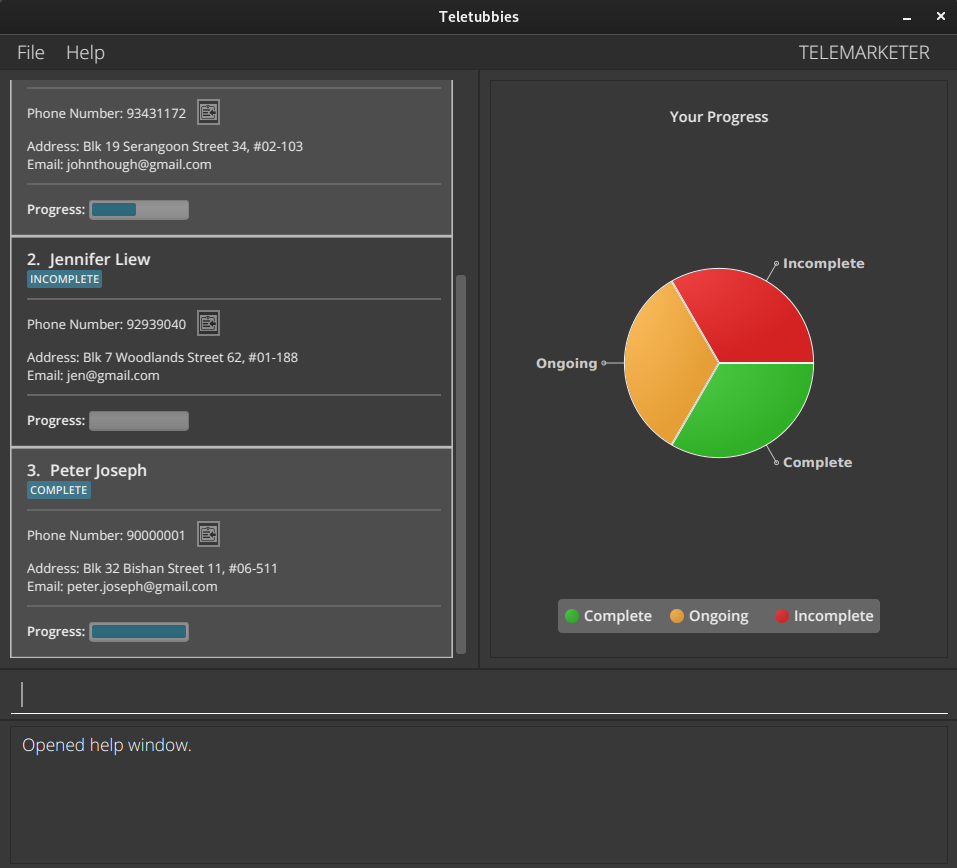
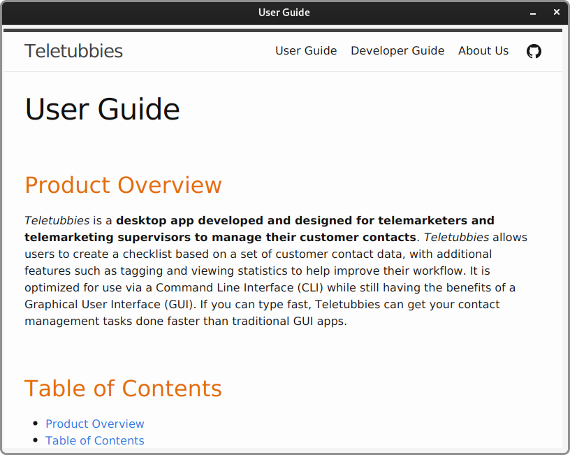
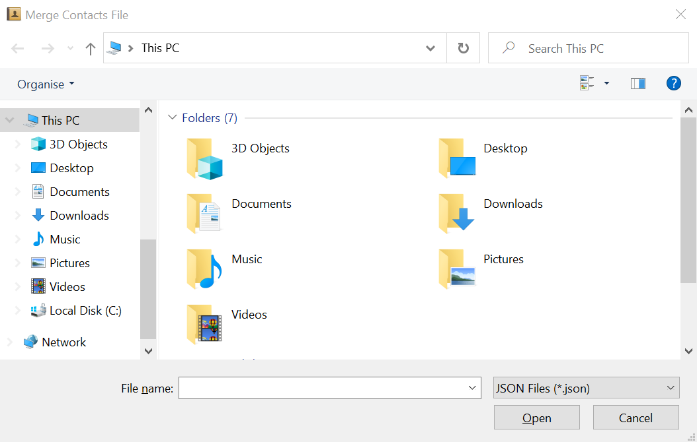
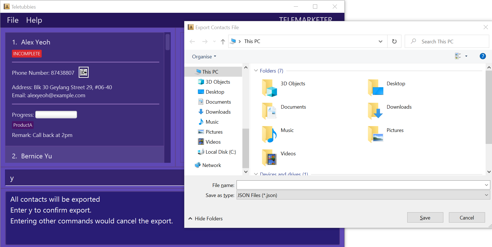
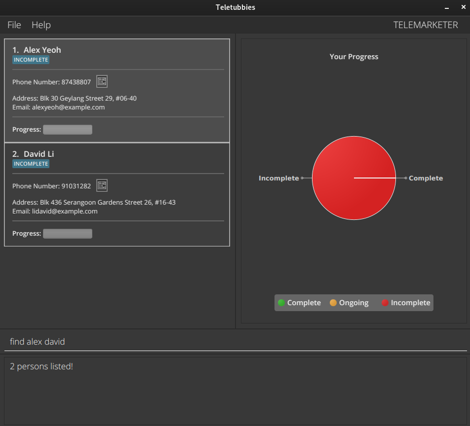
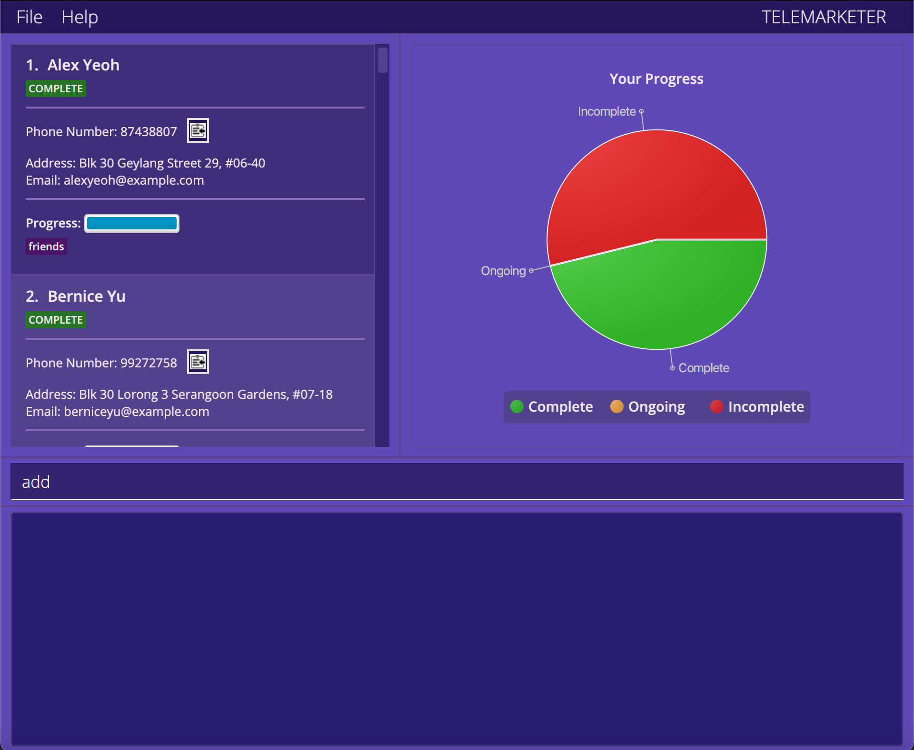
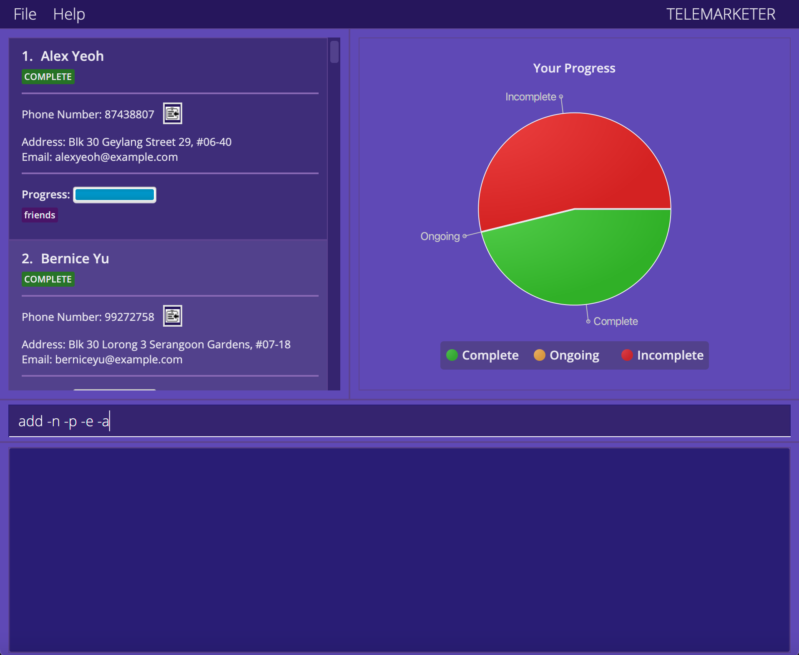

## Product Overview

*Teletubbies* is a **desktop app developed and designed for telemarketers and telemarketing supervisors to manage their
customer contacts**. *Teletubbies* allows users to create a checklist based on a set of customer contact data, with additional
features such as tagging and viewing statistics to help improve their workflow. It is optimized for use via a
Command Line Interface (CLI) while still having the benefits of a Graphical User Interface (GUI). If you can type fast,
Teletubbies can get your contact management tasks done faster than traditional GUI apps.

## Table of Contents
* Table of Contents
{:toc}

--------------------------------------------------------------------------------------------------------------------

## How to navigate through this User Guide

The purpose of this User Guide is to familiarize some of the features of Teletubbies and create a seamless user experience for you. Telemarketers and telemarketer supervisors (such as yourselves) can peruse through the User Guide and try out some of the features available!

This User Guide for *Teletubbies* is written with chronological navigation in mind. Users can scroll through
the document to navigate from section to section. If you are new to *Teletubbies*, we recommend that you take this
approach for an introduction to the features.

For more experienced users who know what they are looking for and want to quickly jump to a specific section, you can move to your section of choice using the [Table of Contents](#table-of-contents), or from the [Command Summary](#command-summary) section if you are interested in learning about the usage of a specific command.

Alternatively, you may use the Windows shortcut **Ctrl + F** or the Mac shortcut **Command + F** to find specific keywords.

<div style="page-break-after: always;"></div>

### Glossary of definitions

**_Command-line Interface (CLI)_**: A user interface that allows users to interact with a system through text commands.

**_Graphical User Interface (GUI)_**: A user interface that allows users to interact with a system through graphical icons.

**_JavaScript Object Notation (JSON)_**: A text-based representation of structured data that is used to save contacts as files in *Teletubbies*.

**_Parameter_**: Input to a command's field.

### Glossary of icons and symbols
:information_source: : Additional information <br/>
:bulb: : Tip <br/>
:exclamation: : Important <br/>
:x: : Error / Avoid <br/>

<div markdown="block" class="alert alert-info">

**:information_source: Information block**<br>

* We use these blocks to enhance the readability of this guide!
</div>

> Quotes are used to explain examples for commands.

--------------------------------------------------------------------------------------------------------------------

<div style="page-break-after: always;"></div>

## Quick start

1. Ensure you have Java `11` or above installed on your Computer. Please refer to [this article](https://www.codejava.net/java-se/download-and-install-java-11-openjdk-and-oracle-jdk)
   for more information on how to install Java `11`.

2. Download the latest `teletubbies.jar` from [here](https://github.com/AY2122S1-CS2103T-W15-4/tp/releases).

3. Copy the file to the folder you want to use as the _home folder_ for your *Teletubbies* app.

4. Double-click the file to start the app. A GUI similar to below should appear in a few seconds. Note how the app contains some sample data.



5. Type the command in the command box and press Enter to execute it.
> E.g. typing **`help`** and pressing Enter will open the help window.<br>

Some example commands you can try:

* `list`: Lists all contacts.
* `add -n John Doe -p 87654321`: Adds a contact named `John Doe` to *Teletubbies*, with the phone number 87654321.
* `delete -i 3`: Deletes the 3rd contact shown in the current list.
* `done 3`: Marks the 3rd contact shown in the current list as done.
* `clear`: Deletes all contacts.
* `exit`: Exits the app.

6. Refer to the [Features](#features) section for details of each command.

--------------------------------------------------------------------------------------------------------------------

<div style="page-break-after: always;"></div>

## Command summary

These are all the available commands in *Teletubbies*.

To navigate to the section for each command, click on the hyperlinked commands in the left column.
The sections outline the detailed usage and examples for each of the command.

We divided and categorised all of our features into these 4 categories in order to give you a bird’s eye view of some of the features available! You can peek into [System commands](#system-commands) to take a look at some of the system-level features available such as [help](#viewing-help-help) and [import](#importing-contacts-import). [Contact commands](#contact-commands) includes all the commands which allow you to modify the contacts in your contact list, while [List commands](#list-commands) includes commands to modify the list of contacts.

System commands | Format
--------|------------------
**[help](#viewing-help-help)** | `help`
**[profile](#setting-your-profile-profile)** | `profile -n NAME -role ROLE`
**[import](#importing-contacts-import)** | `import`
**[merge](#merging-contacts-merge)** | `merge`
**[export](#exporting-contacts-export)** | `export [-t TAGS]…​`
**[history](#listing-your-previous-commands-history)** | `history`
**[undo](#undoing-your-previous-commands-undo)** | `undo`
**[redo](#redoing-your-previous-commands-redo)** | `redo`
**[clear](#clearing-all-entries-clear)** | `clear`
**[exit](#exiting-the-program-exit)** | `exit`

Contact commands | Format
--------|------------------
**[add](#adding-a-contact-add)** | `add -n NAME -p PHONE_NUMBER [-a ADDRESS] [-e EMAIL]`
**[delete](#deleting-a-contact-delete)** | `delete -p PHONE_NUMBER` or `delete -i INDEX`
**[edit](#editing-a-contact-edit)** | `edit INDEX [-n NAME] [-p PHONE] [-e EMAIL] [-a ADDRESS]`
**[done](#marking-a-contact-as-completed-done)** | `done INDEX [STATUS]`
**[tag](#tagging-contacts-tag)** | `tag INDEX -n TAGNAME [-v VALUE] [-s]`
**[tagrm](#removing-tags-from-contacts-tagrm)** | `tagrm INDEX -n TAGNAME [-v VALUE]`
**[tag <br>(multiple contacts)](#tagging-and-removing-tags-from-multiple-contacts)** | `tag INDEX [,INDEX]…​ -n TAGNAME [-v VALUE] [-s]` <br> `tag START-END -n TAGNAME [-v VALUE] [-s]`
**[tagrm <br>(multiple contacts)](#tagging-and-removing-tags-from-multiple-contacts)** | `tagrm INDEX [,INDEX]…​ -n TAGNAME [-v VALUE]` <br> `tagrm START-END -n TAGNAME [-v VALUE]`
**[remark](#adding-a-remark-to-a-contact-remark)** | `remark INDEX -r REMARK`

List commands | Format
--------|------------------
**[list](#listing-all-contacts-list)** | `list`
**[find](#locating-contacts-by-name-find)** | `find KEYWORD [KEYWORD]…​`
**[filter](#filtering-contact-list-filter)** | `filter -t TAGNAME[:TAGVALUE] [-t TAGNAME[:TAGVALUE]]…​ `

<div markdown="block" class="alert alert-info">

**:information_source: Notes about the command format:**<br>

* Words in `UPPER_CASE` are the parameters to be supplied by the user.<br>
  e.g. in `add -n NAME`, `NAME` is a parameter which can be used as `add -n John Doe`.

* Items in square brackets are optional.<br>
  e.g. `-n NAME [-t TAG]` can be used as `-n John Doe -t friend` or as `-n John Doe`.

* Items with `…`​ after them can be used multiple times or left blank.<br>
  e.g. `[-t TAG]…​` can be used as ` ` (i.e. 0 times), `-t friend`, `-t friend -t family` etc.

* Parameters can be in any order.<br>
  e.g. if the command specifies `-n NAME -p PHONE_NUMBER`, `-p PHONE_NUMBER -n NAME` is also acceptable.

* If a parameter is expected only once in the command but you specified it multiple times, only the last occurrence of the parameter will be taken.<br>
  e.g. if you specify `-p 12341234 -p 56785678`, only `-p 56785678` will be taken.

* Extraneous parameters for commands that do not take in parameters (such as `help`, `list`, `exit` and `clear`) will be ignored.<br>
  e.g. if the command specifies `help 123`, it will be interpreted as `help`.

</div>

--------------------------------------------------------------------------------------------------------------------

## Features

Features and corresponding commands have been categorised into:

1. [System commands](#system-commands)
2. [Contact commands](#contact-commands)
3. [List commands](#list-commands)
4. [Other features](#other-features)

### System commands

These commands are related to the *Teletubbies* application as a whole. The commands available are:
* [`help`](#viewing-help-help)
* [`profile`](#setting-your-profile-profile)
* [`import`](#importing-contacts-import)
* [`merge`](#merging-contacts-merge)
* [`export`](#exporting-contacts-export)
* [`history`](#listing-your-previous-commands-history)
* [`undo`](#undoing-your-previous-commands-undo)
* [`redo`](#redoing-your-previous-commands-redo)
* [`clear`](#clearing-all-entries-clear)
* [`exit`](#exiting-the-program-exit)

<div style="page-break-after: always;"></div>

#### Viewing help: `help`

Upon entering the `help` command, another window pops up with our comprehensive User Guide (as shown below) which you can read by scrolling up and down!



Format: `help`

<div style="page-break-after: always;"></div>

#### Setting your profile: `profile`

The `profile` command will help you to set your user profile for *Teletubbies*.

In *Teletubbies*, your user profile consists of your **name** and **role**.

Your **name** should be the name that you use in the workplace, so that
you can be identifiable by your co-workers and supervisors.

Your **role** should be according to your job scope:

* If your job is a telemarketing job, and you want to be able to view your customers
  in an organised list and keep track of your progress, then your role is `Telemarketer`.
* If your job involves keeping track of progress for telemarketers under you, then
  your role is `Supervisor`.

The reason we specify your **role** is so that *Teletubbies* can better accommodate your needs
by providing you with the suitable features tailored to your needs.

Once you set your profile up with the `profile` command, you should be good to go!

Format: `profile -n NAME -role ROLE`

Examples:
* `profile -n David Wong -role Telemarketer`
> This command will set your name as "David Wong" and your role as "Telemarketer".
* `profile -n Anne Goh -role Supervisor`
> This command will set your name as "Anne Goh" and your role as "Supervisor".
* `profile -n -role Telemarketer`
> This command will set your role as "Telemarketer".

<div markdown="block" class="alert alert-info">

**:information_source: Note:**<br>

Teletubbies provides the option for users to leave their names as empty, but it is highly recommended for you to set your name for identification purposes.

Additionally, the `profile` command can only be used to set up your user profile once. To modify your name or role, please follow the steps [here](#faq).

</div>

<div markdown="block" class="alert alert-warning">

**:exclamation: Important:**<br>

If you are opening Teletubbies for the first time, you should be sure to set your profile before doing any actions. 
</div>

<div style="page-break-after: always;"></div>

#### Importing contacts: `import`

The `import` command will help you to import a set of customer contact data into the application.

You can issue this command by either typing it into the CLI (`import`), or going to the menu bar at the top and
selecting `File -> Import`. Once the command is issued, *Teletubbies* will open a file selector window as shown below.

The data to be imported must be a JSON file, with the file extension `.json`.


Format: `import`

<div markdown="span" class="alert alert-warning">:exclamation: Caution:
If the format of the selected data file is invalid, Teletubbies will start with an empty contact list!
</div>

<br>

<div markdown="span" class="alert alert-warning">:exclamation: Caution:
`import` will cause all our current contacts to be wiped from Teletubbies! If you wish to keep 
your current contacts too, check out [merge](#merging-contacts-merge)!
</div>

<div style="page-break-after: always;"></div>

#### Merging contacts: `merge`

The `merge` command is a special kind of importing, and it will help you to merge a set of customer contact data
with the current data inside the application.

You can issue this command by either typing it into the CLI (`merge`), or going to the menu bar at the top and
selecting `File -> Merge`. Once the command is issued, *Teletubbies* will open a file selector window as shown below.

The data to be imported and merged must be a JSON file, with the file extension `.json`.



Format: `merge`

<div markdown="span" class="alert alert-warning">:exclamation: Caution:
This command should only be used if you are sure that you want to combine the new data to be imported with
the current data in the application. The new data will overwrite the current data, so be careful!
</div>

<div style="page-break-after: always;"></div>

#### Exporting contacts: `export`

The `export` command will help you to export the current set of customer contact data in the application.

You can issue this command by either typing it into the CLI (`export`), or going to the menu bar at the top and
selecting `File -> Export`. Note that there is a crucial difference here:

* If you choose to type it into the CLI (`export`), you will be able to specify which contacts you want
  to export, based on the tags.
* If you select `File -> Export` through the GUI, *Teletubbies* will automatically export ALL contacts, regardless of
  tags.

Once the command is issued, it will ask you to confirm the export. Type `y` to confirm the export.

If you decide to cancel the export, you can type in any other command. *Teletubbies* will automatically cancel the export
for you as long as the next command received is NOT `y`.

After export has been confirmed, *Teletubbies* will open a file selector window as shown below. Using
the file selector, you can choose where the exported file will be saved and name the file.



Format: `export [-t TAGS]…​`

Examples:
* `export`
> This command will export all contacts.
* `export -t friends`
> This command will export all contacts containing the "friends" tag.
* `export -t friends -t family`
> This command will export all contacts containing BOTH the "friends" tag, and the "family" tag.

<div markdown="span" class="alert alert-warning">:bulb: Tip: You can use the filtered list displayed on Teletubbies to double-check if the contacts you want to export are accurate, saving you precious time with Teletubbies’ easy-to-read interface! 
</div>

<div style="page-break-after: always;"></div>

#### Listing your previous commands: `history`

The `history` command will help you to view all the commands that have been issued by you in the **current session**.

The commands will be displayed in order from the most recently issued command to the earliest issued command.

Format: `history`

<div markdown="block" class="alert alert-info">

**:information_source: Commands that will be displayed:**<br>

The **current session** refers to the duration from the time you start up *Teletubbies* to the time
you close or exit *Teletubbies*. Once you close or exit *Teletubbies*, your session will end, and the command history will be
reset. The next time you start up *Teletubbies*, you will not be able to access the command history from your
previous session.

</div>

<div style="page-break-after: always;"></div>

#### Undoing your previous commands: `undo`

The `undo` command will help you to undo any changes you have made with your previous command.

Suppose that you entered a command, but realised that you made a mistake! Well, you can simply issue the
`undo` command to undo your mistake.

If there are no commands that have previously been issued in the current session, *Teletubbies* will let you know.
Otherwise, any changes you may have made with your previous command will be undone, so be careful when using this command!

Format: `undo`

<div markdown="block" class="alert alert-info">

**:information_source: Note:**<br>

The following commands cannot be undone since they don't affect contact information:
* `export`
* `filter`
* `find`
* `help`
* `history`
* `list`
* `profile`

</div>

<div markdown="block" class="alert alert-info">

**:information_source: Retrieving previous versions:**<br>

Like [`history`](#listing-your-previous-commands-history), you can only retrieve changes made within your **current session**. That is, once you close or exit Teletubbies and close your current session, you will not be able to retrieve the previous versions of Teletubbies.
</div>

#### Redoing your previous commands: `redo`

The `redo` command will help you to redo any `undo` command you have issued previously.

Suppose that you through you made a mistake, so you issued an `undo` command, only to realise later that
it was actually the correct command! Well, you can simply issue the `redo` command to "undo" your `undo`, or
simply put, redo a command that you thought was a mistake.

If there are no commands that have previously been issued in the current session, *Teletubbies* will let you know.
Otherwise, any changes you may have made with your previous `undo` command will be undone, so be careful when using this command!

Format: `redo`

<div style="page-break-after: always;"></div>

#### Clearing all entries: `clear`

The `clear` command will help you clear all contacts from the Teletubbies application.

Format: `clear`

<div markdown="span" class="alert alert-warning">:exclamation: Caution:
Do NOT issue this command unless you are absolutely sure that you want to clear the list.
</div>

<div style="page-break-after: always;"></div>

#### Exiting the program: `exit`

The `exit` command will help you gracefully exit *Teletubbies*.

Format: `exit`

<div style="page-break-after: always;"></div>

### Contact commands

These commands are related to the contacts stored in *Teletubbies*. The commands available are:
* [`add`](#adding-a-contact-add)
* [`delete`](#deleting-a-contact-delete)
* [`edit`](#editing-a-contact-edit)
* [`done`](#marking-a-contact-as-completed-done)
* [`tag`](#tagging-contacts-tag)
* [`tagrm`](#removing-tags-from-contacts-tagrm)
* [`remark`](#adding-a-remark-to-a-contact-remark)


#### Finding the index

When dealing with contacts in *Teletubbies*, you will often have to use something called the **index**
of the contact.

To find out what the contact's index is, use the [List](#listing-all-contacts-list) feature to
find what number the contact is associated with in the contact list.

The index
will always be a positive integer, i.e. 1, 2, 3, 4, ...

#### Copying phone numbers

We understand that as telemarketers, you may be using a desktop application to call a customer instead of using
your phone.

Hence, *Teletubbies* tries to help out in this area as well! Next to the phone number in each contact, there is a small
clipboard icon that looks like this: 

When you click on the icon, it will copy the phone number to your clipboard, so that you can paste it onto
your desktop calling app!

<div style="page-break-after: always;"></div>

#### Adding a contact: `add`

The `add` command will help you to add a customer's contact details into *Teletubbies*. Once added,
you should be able to view their contact details on the contact list.

Note that the customer's **name** and **phone number** are mandatory. Otherwise, *Teletubbies*
(and you) will find it difficult to identify the customer!

Other than the **name** and the **phone number**, you can also indicate **address** and
**email address**. Both **address** and **email address** are optional.

Format: `add -n NAME -p PHONE_NUMBER [-a ADDRESS] [-e EMAIL]`

Examples:
* `add -n Betsy Crowe -p 12345678`
> This command will add the contact details for "Betsy Crowe", with their phone number as "12345678".
* `add -n John Doe -p 87654321 -a John Street, Block 123, #01-01`
> This command will add the contact details for "John Doe", with their phone number as "87654321". It will
> also add their address as "John Street, Block 123, #01-01".
* `add -n John Snoe -p 98765432 -a Wall Street, Block 234, #08-06 -e johns@example.com`
> This command will add the contact details for "John Snoe", with their phone number as "98765432". It will
> also add their address as "Wall Street, Block 234, #08-06", and their email address as "johns@example.com".

<div style="page-break-after: always;"></div>

#### Deleting a contact: `delete`

The `delete` command will help you to delete a customer's contact details from *Teletubbies*. Once
the contact has been deleted, you should no longer see their contact details on the contact list.

You can choose to delete the contact using either the index, or the phone number. When deleting the contact using the phone number, make sure that the specified
phone number is associated with a contact in the contact list.

<div markdown="block" class="alert alert-info">

**:bulb: Deleting with a contact's index:**<br>

If you don't know what the index is, refer to [Finding the index](#finding-the-index).

</div>

Format: `delete -p PHONE_NUMBER` or `delete -i INDEX`

Examples:
* `delete -i 1`
> This command will delete the contact details for the contact with the index 1.
* `delete -p 87654321`
> This command will delete the contact details for the contact with the phone number "87654321".

<div style="page-break-after: always;"></div>

#### Editing a contact: `edit`

The `edit` command will help you to edit / update a customer's contact details in *Teletubbies*. Note that
you can only edit the details for a contact that is already in *Teletubbies*' contact list.

You can choose which contact to edit by using the contact's index. If you don't know what the index is, refer to [Finding the index](#finding-the-index).

When editing the contact, you will be able to change four fields in total: the **name**,
the **phone number**, the **address**, and the **email address** of the customer.

Each field is treated as
separate, and all four fields are optional, meaning that you can choose to edit only one or two out of the four fields.
However, at least one field should be provided (otherwise, you won't be editing anything).

Format: `edit INDEX [-n NAME] [-p PHONE] [-e EMAIL] [-a ADDRESS]`

Examples:
* `edit 1 -n Betsy Crower`
> This command will edit the name of the first person in the list to be "Betsy Crower".
* `edit 2 -p 91234567 -e johndoe@example.com`
> This command will edit the phone number of the second person in the list to be "91234567", and the email address to be "johndoe@example.com".

<div style="page-break-after: always;"></div>

#### Marking a contact as completed: `done`

The `done` command will help you to mark a contact's completion status in *Teletubbies*. Here, when we say "completion status",
we will leave it up to your company to decide exactly what each of the levels of completion status mean.

Regardless, *Teletubbies* provide three different levels of completion status: **Incomplete**, **Ongoing**, and **Complete**. Take note that
a contact can only be marked with at most one out of the three. You can't have a contact be complete and ongoing at the same time!
**The status is indicated in each of the contact details using a tag and a progress bar.**

You can mark a contact with any of the three levels using the **index** of the contact. If you don't know what the index is, refer to [Finding the index](#finding-the-index).

You will also be able to see the total level of completion status for a list of customers using the "Your Progress" tab, which displays
the information using a chart. Refer to [Progress Chart](#progress-chart) for more details.

Format: `done INDEX [STATUS]`

Examples:
* `done 1`
> This command will mark the first contact in the list as "Complete".
* `done 2 -ong`
> This command will mark the second contact in the list as "Ongoing".
* `done 3 -inc`
> This command will mark the third contact in the list as "Incomplete".

<div style="page-break-after: always;"></div>

#### Tagging contacts: `tag`

The `tag` command will help you to **tag** certain contacts with a tag of your choice. In *Teletubbies*,
our tags are very flexible: They can be single words, or a category. So for example, you can tag a contact
with "friend", or tag a contact with the category "status: not answering", etc. It's up to you!

Do note that there is a special category of tag, which is the **completion status**.
This tag cannot be added, edited or removed by the `tag` command or the `tagrm` command, and is only changeable using
the `done` command. Please refer to [Marking a contact as completed](#marking-a-contact-as-completed-done).

When tagging a contact, you can specify the **name** and **value** of the tag. The **name** is mandatory, but
the **value** is optional. To specify which contact to be tagged, use the index of the contact.
If you don't know what the index is, refer to [Finding the index](#finding-the-index).

Take note that contacts cannot have tags with duplicate names. So, if you have a contact that is already tagged,
and you decide to tag it again with the same **name** but different **value**, the new **value** will replace the old
one! For example, if a contact tagged with `Friend: good`, and is then tagged using another tag with the **name** "Friend"
and the **value** "close", the pre-existing tag will be updated from `Friend: good` to `Friend: close`.

Finally, there is an additional parameter that is only available to supervisors. When you add a `-s` at the end
of your tagging command, it will make sure that only supervisors are able to edit or remove that tag!

Format:`tag INDEX -n TAGNAME [-v VALUE] [-s]`

Examples:

* `tag 1 -n Friend`
> This command will tag the first contact in the list with the tag `Friend`.
* `tag 2 -n Friend -v close`
> This command will tag the second contact in the list with the tag `Friend: close`.
* `tag 4 -n Assignee -v Mel -s`
> This command will tag the fourth contact in the list with the tag `Assignee: Mel`. Because of the `-s`, this tag will only be editable / removable by
> users whose roles are set as "Supervisor" For more information on roles, refer to [Setting your profile](#setting-your-profile-profile).

<div style="page-break-after: always;"></div>

#### Removing tags from contacts: `tagrm`

The `tagrm` command will help you to **remove** a tag from a contact. Note that the tag to be removed
must already be a tag on the contact, otherwise no tags will be removed!

When removing a tag from a contact, you can specify the **name** and **value** of the tag. Similar to the `tag` command,
the **name** is mandatory, but the **value** is optional. To specify which contact to be tagged, use the index of the
contact. If you don't know what the index is, refer to [Finding the index](#finding-the-index).

Note that tag name and tag value are case-sensitive. So, a command specifying tag name 'assignee' and tag value 'john'
will not remove the tag `Assignee:John` or `Assignee:john`.

Also, if the tag was created using the `-s` parameter, only supervisors will be able to remove the tag.

Format:`tagrm INDEX -n TAGNAME [-v VALUE]`

Examples:

* `tagrm 1 -n Friend`
> This command will remove the tag `Friend` from the first contact in the list.
* `tagrm 2 -n Friend -v close`
> This command will remove the tag `Friend: close` from the second contact in the list.

<div style="page-break-after: always;"></div>

#### Tagging and Removing tags from multiple contacts

Sometimes, you may need to assign the same tag to more than just one contact, or remove the same tag from more than just one contact.

You can use the `tag` and the `tagrm` commands to do so! Just specify a **range of numbers** as the index rather than a single number.

Format (`tag`): `tag INDEX [,INDEX]…​ -n TAGNAME [-v VALUE] [-s]`

Format (`tagrm`): `tagrm INDEX [,INDEX]…​ -n TAGNAME [-v VALUE]`

OR

Format (`tag`):`tag START-END -n TAGNAME [-v VALUE] [-s]`

Format (`tagrm`):`tagrm START-END -n TAGNAME [-v VALUE]`

Examples (`tag`):

* `tag 1,2,4 -n Friend -v close`
> This command will tag the first, second, and fourth contact in the list with the tag `Friend: close`.
* `tag 1-5 -n Friend -v close`
> This command will tag the first five contacts in the list, with the tag `Friend: close`.
* `tag 1-10 -n Assignee -v Mel -s`
> This command will tag the first ten contacts in the list with the tag `Assignee: Mel`. Because of the `-s`, this tag will only be editable / removable by
> users whose roles are set as "Supervisor" For more information on roles, refer to [Setting your profile](#setting-your-profile-profile).

Examples (`tagrm`):

* `tagrm 1,2,4 -n Friend`
> This command will remove the tag `Friend` from the first, second, and fourth contact in the list.
* `tagrm 1-5 -n Friend `
> This command will remove the tag `Friend` from the first five contacts in the list.

<div style="page-break-after: always;"></div>

#### Adding a remark to a contact: `remark`

The `remark` command will help you to add a remark to a chosen contact in the list. Remarks are a more general version
of the tags - the feature is for you to add extra information to a contact that you cannot add using tags. Note that a
remark cannot be longer than 40 letters!

To specify which contact to add a remark to, use the index of the contact. If you don't know what the index is,
refer to [Finding the index](#finding-the-index).

Format: `remark INDEX -r REMARK`

Examples:
* `remark 1 -r Not answering any calls`
> This command will add the remark `Not answering any calls` to the first contact in the list.
* `remark 1 -r `
> This command will remove the existing remark from the first contact in the list.
* `remark 2 -r Not answering any calls`
* `remark 2 -r Need to call back for confirmation`
> The first command will add the remark `Not answering any calls` to the second contact in the list. The second command
> will then add the new remark `Need to call back for confirmation` to the second contact in the list, which will replace the
> old remark `Not answering any calls`.


<div markdown="block" class="alert alert-info">

**:information_source: Only one remark allowed per contact**<br>

A contact can only have a maximum of **one** remark. If a contact already has a remark, any new remark added
will replace the existing remark.
</div>

<div style="page-break-after: always;"></div>

### List commands

These commands are related to the contact list stored in *Teletubbies*. The commands available are:
* [`list`](#listing-all-contacts-list)
* [`find`](#locating-contacts-by-name-find)
* [`filter`](#filtering-contact-list-filter)


#### Listing all contacts: `list`

The `list` command will help you to view the entire contact list currently in *Teletubbies*.

By listing all contacts, you will be able to find the number associated with a specific contact that you want to interact with.
This number is known as the `index` of the contact.

Format: `list`

<div style="page-break-after: always;"></div>

#### Locating contacts by name: `find`

The `find` command will help you find the relevant contacts using the given keyword(s), and will change the contact list
display to show only the contacts whose **names** contain the given keyword(s).

When *Teletubbies* searches the contacts using the given keyword(s), it will only look at the **names**
of the contacts, not the **addresses** or the **email addresses**.

The order of the keywords given does not matter, and any contact whose **name** contains any one of the
keywords will be returned. However, *Teletubbies* will consider the keywords as full words, meaning that
if a keyword `Han` is given, even if there is a contact with the name `Hans`, it will not be returned. It
will only be returned if the keyword given is `Hans`.

For instance, `find alex david` may return something like:



Format: `find KEYWORD [KEYWORD]…​`

Examples:
* `find John`
> This command will return all contacts whose names contain "John", such as `John`, `john`, or `John Doe`. As mentioned below, it is case-insensitive.
* `find alex david`
> This command will return all contacts whose names contain "alex" or "david" in no particular order, such as `Alex Yeoh`, `david li`, or `David alex`.


<div markdown="block" class="alert alert-info">

**:information_source: Keywords are case-insensitive:**<br>

The search process is case-insensitive, meaning that if a keyword `hans` is given, a contact with the name `Hans` may
be returned.
</div>

<div style="page-break-after: always;"></div>

#### Filtering contact list: `filter`

The `filter` command will help you filter the current contact list using the given tag(s), and will change the contact list
display to show only the contacts that are tagged with the given tag(s).

When issuing the `filter` command, you should specify at least one **tag name**. Tag values are optional, but can help to further narrow
your filter if necessary.

<div markdown="block" class="alert alert-info">

**:information_source: Tag name and tag value are case-sensitive:**<br>

This means that the following tags are different:
- `assignee: john`
- `assignee: John`
- `Assignee: John`

</div>

Format: `filter -t TAGNAME[:TAGVALUE] [-t TAGNAME[:TAGVALUE]]…​ `

Examples:
* `filter -t Friend`
> This command will filter the displayed list to only users who have the tag `Friend`, regardless of tag value. This
> means that persons with the tags `Friend: Close`, AND `Friend: VeryClose` will both be listed.
* `filter -t Assignee:Ben`
> This command will filter the displayed list to only users who have the tag `Assignee: Ben`. Persons with the
> `Assignee: Sid` tag will NOT be listed.
* `filter -t Friend -t Assignee:Ben`
> This command will filter the displayed list to only users who have the tag `Friend` AND `Assignee: Ben`. Contacts
> that have only one of the given tags will NOT be listed.

<div style="page-break-after: always;"></div>

### Other features

#### Progress Chart

Since each contact has a completion status tied to it with the levels of completion status
`Complete`, `Ongoing`, or `Incomplete`, Teletubbies will automatically collate the data and
create a nice pie chart to display the aggregate completion status of the current list.

Whenever the list that you are viewing changes (usually when issuing [list commands](#list-commands)),
the chart will update automatically!

#### Convenience features

Sometimes, you may feel hard-pressed from typing these commands repeatedly. You can avoid this by trying out some
of our convenience features in Teletubbies. These include:
* Pressing the **[UP]** arrow button on your keyboard to retrieve a previously keyed-in command,

<div markdown="block" class="alert alert-info">:information_source: Tip:
You can only access the previous commands up to the first command keyed in after starting Teletubbies. Once the earliest command is obtained, you will continue to see that command on the text input box.
</div>


* Pressing the **[DOWN]** arrow button on your keyboard to retrieve the command after the current command,

<div markdown="block" class="alert alert-info">:information_source: Tip:
Once the most recent command is obtained, you will continue to see that command on the text input box.
</div>

* Pressing the **[TAB]** key after typing a command to automatically complete and suggest to you the required fields needed for the command word.

<div markdown="block" class="alert alert-info">:information_source: Tip:
For instance, pressing the **[TAB]** key after typing `add` produces `add -n -p -e -a` on the text input box.

Here is an image of Teletubbies before pressing the **[TAB]** key: 
</div>


<div style="page-break-after: always;"></div>

> And here is an image of Teletubbies after pressing the **[TAB]** key:
>
>
> It is important to note that pressing the **TAB** key will only work if the given word is a command word. For example,
> if you type `ad` and then press the **TAB** key, the given text will remain.

<div style="page-break-after: always;"></div>

##### Saving the data

*Teletubbies* automatically saves the data in the hard disk after any command that changes the data. There is no need to save manually.

For exporting the current data as a separate JSON file, refer to [Exporting contacts](#exporting-contacts-export).

#### Loading the data

*Teletubbies* will automatically load up the data from your previous session, allowing you to pick up right where you left off. There is no need to load manually.

For importing a contact list in the JSON file format into the application, refer to [Importing contacts](#importing-contacts-import).
For merging a contact list from your hard disk with the contact list on the application, refer to [Merging contact lists](#merging-contacts-merge)

#### Editing the data

*Teletubbies* will save the data as a JSON file `[JAR file location]/data/teletubbies.json`. Advanced users are welcome to update data directly by editing that data file.

<div markdown="span" class="alert alert-warning">:exclamation: Caution:
If your changes to the data file makes its format invalid, Teletubbies will discard all data and start with an empty data file at the next run!
</div>

--------------------------------------------------------------------------------------------------------------------

<div style="page-break-after: always;"></div>

## FAQ

**Q**: How do I transfer my data to another Computer?<br>
1. Install the *Teletubbies* app in the other computer.
2. Use the [`export`](#exporting-contacts-export) command to export your contacts as a JSON file. Transfer the contacts file to the other computer.
3. On the other computer, launch the *Teletubbies* app and use the [`import`](#importing-contacts-import) command to import the contacts file that you transferred over.

**Q** How do I change my role after setting it once?<br>
1. In the same folder as `teletubbies.jar`, look for the `preferences.json` file.
2. In `preferences.json`, locate the `isProfileSet` field and set it to false as follows:

  ```
     {
      
       ...
      
       "userProfile" : {
         "name" : "",
         "role" : "SUPERVISOR"
       },
       "isProfileSet" : false, // set this field to false
      
       ...
              
     }
   ```

3. When you restart teletubbies, you should be able to modify your role with the [profile](#setting-your-profile-profile) command.
